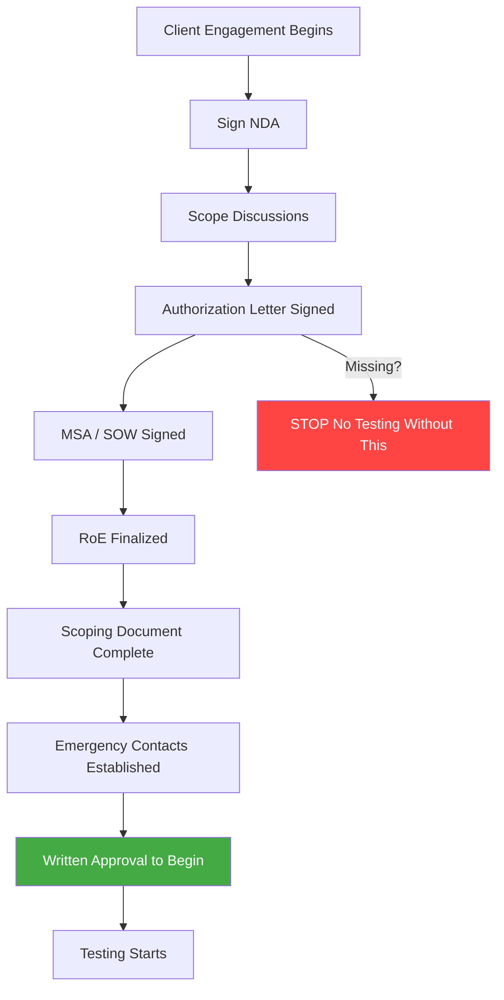
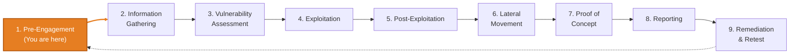

import { Callout } from 'nextra/components'

# Pre-Engagement

<Callout type="important">
 **No testing without written authorization. Period.** Verbal approval = zero legal
 protection. Every engagement, every time, even for repeat clients. The only
 difference between a pentester and a criminal is a signed piece of paper.
</Callout>

### Phase 1: Legal Foundation

<Callout type="default" emoji="?">
 **Ask yourself**

 - Does the person signing the authorization actually have legal authority to
 authorize testing, or is it just an IT admin without standing?
 - Is the authorizing entity the legal *owner* of the systems, or only the
 operator? For subsidiaries, does the parent company need to authorize too?
 - For managed/cloud infrastructure, does the MSP or hosting provider need
 separate authorization on top of the client's?
 - Does the paperwork explicitly reference the IT Act 2000 Section 43 exemption
 for India engagements?
 - Is your professional liability insurance active and does it cover pentest
 activities?
</Callout>

- [ ] **Sign NDA first** :before any scope discussions or sharing of technical details (covers vulnerabilities, topology, credentials, PII, trade secrets; duration 2-5 years minimum, indefinite for trade secrets).
- [ ] **Obtain signed authorization letter** naming you/your company, listing exact scope, permitted methods, and testing window, signed by someone with actual authority (not just the IT admin), referencing IT Act 2000 Section 43 for India engagements.
- [ ] **Sign MSA** (ongoing relationship) or **SOW** (per engagement) with liability cap, indemnification, scope limitation, payment terms, and a data handling + destruction clause.
- [ ] **Create and sign RoE** : your "get out of jail free" letter: all in-scope and out-of-scope systems listed, permitted/prohibited techniques documented, testing windows with timezone, emergency contacts and escalation.
- [ ] **Verify third-party/cloud authorization** :AWS/Azure/GCP provider pentest policy and notification forms, Indian hosting providers contacted directly, CDN/WAF providers (Cloudflare, Akamai) notified if applicable.
- [ ] **Review professional liability insurance** confirm coverage for pentest activities before the window opens.

### Phase 2: Scope Definition

<Callout type="default" emoji="?">
 **Ask yourself**

 - Is the scope actually complete, or are there assets the client forgot
 (subdomains, APIs, mobile backends, staging environments)?
 - Are third-party integrations (payment gateways, SSO, CDNs) in scope, and do
 they need separate authorization?
 - Is pivoting into internal systems after initial compromise permitted, or is
 the engagement limited to the perimeter?
 - Which regulated data (HIPAA, PCI DSS, DPDP Act, RBI) sits inside the scope,
 and does that change what you are allowed to touch?
 - What is the pre-agreed workflow when a new asset is discovered mid-engagement?
</Callout>
<callout type="imformation">
[frogy2.0](https://github.com/iamthefrogy/frogy2.0) like tools can be used to do a quick external passive reson based on public sources to get a good idea of the scope.
</callout>

- [ ] **Complete scoping questionnaire** with the client (network, web, AD, cloud, social engineering, compliance).
- [ ] **Create scoping document** what, how, when, limits.
- [ ] **Document all in-scope systems** IPs, CIDR ranges, domains, subdomains, apps, APIs.
- [ ] **Document all off-limits systems** critical infra, medical devices, ICS/SCADA, prod databases, backup/DR systems.
- [ ] **Define testing type** black box / grey box / white box.
- [ ] **Define testing windows** dates, hours, timezone, maintenance windows.
- [ ] **Clarify permitted techniques** social engineering, physical, DoS, account creation/data modification, data exfiltration to prove impact.
- [ ] **Identify sensitive/regulated systems in scope** HIPAA, PCI DSS, GDPR, DPDP Act, RBI-regulated.
- [ ] **Define deliverables and retesting terms** report format, detail level, executive summary, retest included or billed separately.
- [ ] **Define scope-change workflow** who authorizes additions (same authority level as original), written addendum required, timeline/budget impact, updated RoE if risk profile changes.

### Phase 3: Communication & Emergency Setup

<Callout type="default" emoji="?">
 **Ask yourself**

 - Who exactly do you call if you cause a service disruption, and how fast are
 they reachable?
 - Who must be notified for critical/emergency findings (RCE, active breach,
 exposed PII), and on what channel?
 - What is the halt trigger the condition under which you stop testing
 immediately?
 - If you find evidence of a *prior* breach, does the client have a CERT-In
 6-hour reporting obligation, and does your NDA conflict with it?
 - What reporting cadence does the client expect (daily, weekly, end-only)?
</Callout>

- [ ] **Obtain contact list** technical POC, project manager, legal, emergency/on-call.
- [ ] **Define escalation procedures** who to call on disruption, who to notify for critical/emergency findings, and when to halt testing immediately.
- [ ] **Establish communication channels** email (routine), phone/Signal (urgent), ticketing system.
- [ ] **Create incident response plan** what happens if testing triggers a real incident.
- [ ] **Agree on reporting cadence** daily updates, weekly, or only at end.

### Phase 4: Deconfliction & Allowlisting

<Callout type="important">
 This prevents your testing from triggering IR alerts, SOC escalations, or IP
 bans. Share these details with the client's security team **before** testing
 begins. Without deconfliction, your pentest looks exactly like a real attack to
 the blue team.
</Callout>

<Callout type="default" emoji="?">
 **Ask yourself**

 - Will the SOC actually know you are testing, or is this a blind/red-team
 exercise where they are intentionally not notified?
 - If the SOC is outsourced (MSSP), does the MSSP know? They will block your IPs
 and escalate if left out of the loop.
 - For a blind test, who is the single deconfliction contact that can confirm you
 are authorized if things go sideways?
 - For red team work, is there a "safe word" or emergency deconfliction procedure
 that immediately identifies you as the authorized tester if confronted?
</Callout>

- [ ] **Provide source IP addresses** all IPs your traffic originates from (VPN egress, VPS, home IP if applicable).
- [ ] **Provide VPN egress ranges** full CIDR if using a testing VPN.
- [ ] **Provide callback/C2 domains** any domains payloads will beacon to (if C2 is in scope).
- [ ] **Provide phishing domains and mail sender addresses** sending domains, lookalikes, reply-to and from-addresses (if social engineering is in scope).
- [ ] **Provide phone numbers** numbers used for vishing or callback social engineering.
- [ ] **Provide test user agents** custom user-agent strings so the SOC can filter your traffic.
- [ ] **Provide test user accounts** usernames/emails created or provided for testing.
- [ ] **Provide report recipient list** for access control on sensitive findings.
- [ ] **Provide scanning schedule** when heavy scanning will occur.
- [ ] **Get written acknowledgment** from the SOC lead on the deconfliction sheet.

### Phase 5: Environment & Logistics

<Callout type="default" emoji="?">
 **Ask yourself**

 - Is this a clean workspace with zero residual data from previous engagements
 (cross-contamination is catastrophic)?
 - Are you routing traffic through your own attributable infrastructure or
 leaking straight from your ISP?
 - Is client data encrypted at rest and in transit, and access-controlled to
 only NDA-named team members?
 - Can you prove exactly what you did and when if something breaks during the
 window?
 - Does the client have recent, tested backups and staff on hand to restore
 in-scope systems if testing causes disruption?
</Callout>

- [ ] **Set up clean testing VM/workspace** no residual data from previous engagements; snapshot before starting.
- [ ] **Verify all tools are licensed and updated.**
- [ ] **Confirm client has recent, tested backups** of all in-scope systems and staff available to restore during the window.
- [ ] **Set up encrypted storage** for engagement data (LUKS, VeraCrypt, BitLocker).
- [ ] **Set up activity logging** log all testing with timestamps for legal protection.
- [ ] **Prepare report template** start the structure early and fill findings as you go.

### Phase 6: Final Verification

<Callout type="default" emoji="?">
 **Ask yourself**

 - Are every one of NDA, authorization, MSA/SOW, and RoE signed and in your
 possession not "in progress"?
 - Are all emergency contacts confirmed reachable *today*, not just listed on
 paper?
 - Is the testing window confirmed in writing by the client?
 - Do you have an explicit written "you are clear to start" from an authorized
 person before the first packet leaves your box?
</Callout>

- [ ] NDA signed
- [ ] Authorization letter signed (correct authority)
- [ ] MSA/SOW signed
- [ ] RoE signed
- [ ] Contacts confirmed reachable
- [ ] Testing window confirmed in writing
- [ ] Deconfliction sheet acknowledged by SOC
- [ ] Written "clear to start" received
- [ ] **Confirm all documents signed** 
- [ ] **Confirm all contacts reachable.**
- [ ] **Confirm testing window** with the client.
- [ ] **Get explicit written approval to begin** "You are clear to start testing."
- [ ] **Begin testing**

## Reference

### Goals & Objectives of a Penetration Test

Before scoping, pin down *why* the client wants the test. The stated goal shapes
scope, methodology, deliverables, and how you rank findings. A compliance
checkbox engagement and a "can an attacker reach our crown jewels" engagement
look completely different in practice.

<Callout type="default" emoji="?">
 **Ask the client**

 - What is the client actually trying to achieve ? a clean audit certificate,
 validated defenses, or a realistic breach simulation?
 - What regulatory or compliance requirement (if any) is driving this engagement?
 - Is the priority finding vulnerabilities, testing detection/response, or
 quantifying business impact?
 - What does "success" look like to the person paying for the test?
</Callout>

#### Primary Goal Categories

| Category | Focus |
|----------|-------|
| **Security Posture Evaluation** | Assess the organization's overall cybersecurity maturity |
| **Defensive Measures Testing** | Validate whether existing security controls actually work |
| **Risk Assessment** | Evaluate the potential operational and financial impact of a breach |

#### Detailed Objectives

| Objective | What It Means |
|-----------|---------------|
| **Identify Security Weaknesses** | Uncover misconfigurations, software flaws, design weaknesses, and human vulnerabilities |
| **Validate Security Controls** | Attempt to bypass security mechanisms to verify they work as intended |
| **Test Detection & Response** | Determine if the organization can detect and respond to security incidents |
| **Assess Real-World Impact** | Simulate attacks to understand potential data loss, system compromise, or business disruption |
| **Prioritize Remediation** | Help the organization allocate resources to fix the most critical issues first |
| **Compliance & Due Diligence** | Satisfy regulatory requirements (PCI DSS, HIPAA, SOC 2, RBI VAPT, etc.) |
| **Enhance Security Awareness** | Reveal risks that aren't apparent through other means |
| **Verify Patch Management** | Confirm patches and updates are properly applied and effective |
| **Test New Technologies** | Ensure new systems are securely configured before production deployment |
| **Establish Baseline** | Create a measurable starting point for tracking security improvements over time |

### Legal Authorization & Why It Matters

Every penetration test is technically a crime without proper authorization. The
difference between a pentester and an attacker is a signed piece of paper. This
section is the most important in the entire vault get it wrong and no technical
skill will save you.

<Callout type="warning">
 **Never test without written authorization.** Verbal approval, Slack messages,
 or "my manager said it's fine" are not legal protection. Get a signed document
 on company letterhead from someone with authority.
</Callout>

### MSA vs SOW

| Aspect | MSA | SOW |
|--------|-----|-----|
| **Purpose** | Overall business relationship terms | Project-specific engagement details |
| **Scope** | Broad: payment, confidentiality, liability, IP | Narrow: objectives, scope, deliverables, timeline |
| **Use Case** | Ongoing / multiple engagements | Each new project |
| **Duration** | Long-term (1-3 years typical) | Short-term, project duration |
| **Flexibility** | Consistent across engagements | Tailored per engagement |
| **Authorization** | Framework for services | Explicit permission for specific pentest |

<Callout type="default">
 **For repeat clients:** Sign an MSA once, then issue a new SOW for each
 engagement. This saves time on legal review and keeps the per-engagement
 paperwork light.
</Callout>

#### SOW Critical Clauses

| Clause | Why It Matters | What to Include |
|--------|----------------|-----------------|
| **Scope limitation** | Protects against scope creep | Exact systems, methods, timeline |
| **Liability cap** | Limits your financial exposure | Typically 1x-2x contract value |
| **Indemnification** | Client covers you for authorized actions | "Client shall indemnify tester for all claims arising from authorized testing" |
| **Payment terms** | Cash flow protection | 50% advance + 50% on report delivery |
| **IP ownership** | Clarity on deliverables | Reports -> client. Tools, scripts, methodology -> yours |
| **Limitation of findings** | Manages expectations | "Results are point-in-time and do not guarantee security" |
| **Data handling** | Legal compliance | Encryption requirements, retention period, destruction method |
| **Retesting** | Avoid free work | 1 retest included or billed separately state it explicitly |
| **Termination** | Exit strategy | Either party can terminate with N days notice, payment for work completed |

<Callout type="default" emoji="?">
 **Is your SOW actually protecting you?**

 - Does it have a liability cap? Without one, you're exposed to unlimited claims.
 - Does the indemnification clause cover you if authorized testing causes
 unexpected downtime?
 - Is "scope" defined precisely enough that the client can't claim you should
 have tested more?
 - What happens if the client doesn't pay? Is there a dispute resolution clause?
</Callout>

### Rules of Engagement (RoE) Deep Dive

The RoE is the operational contract between you and the client. It defines what
you can do, when, and how.

| Element | Description | Example |
|---------|-------------|---------|
| **In-scope systems** | Exact IPs, domains, apps | `10.10.10.0/24`, `*.target.com`, `app.target.com` |
| **Off-limits systems** | Never touch these | Production DB, medical devices, payment processing |
| **Permitted techniques** | What methods are allowed | Network scanning, web app testing, credential stuffing |
| **Prohibited actions** | Hard no | DoS, physical access, real data exfiltration |
| **Testing windows** | When you can test | Mon-Fri 22:00-06:00 IST, weekends 24/7 |
| **Contacts** | Names, roles, phones, emails | Technical POC, PM, emergency, legal |
| **Communication** | How to report | Email for updates, phone for emergencies |
| **Evidence handling** | How to store/transmit findings | AES-256 encrypted, secure channel only |
| **Critical finding protocol** | Immediate notification rules | RCE/active breach -> phone call within 1 hour |
| **Disclaimers** | Liability protection | Point-in-time assessment, not a guarantee |

<Callout type="default" emoji="?">
 **What if the RoE is too restrictive?**

 - Does the testing window give you enough time? A 4-hour nightly window for a
 full network pentest is unrealistic.
 - Are the prohibited actions reasonable? If you can't test for SQLi on a web app
 engagement, what's the point?
 - Can you pivot to internal systems after initial compromise, or does the RoE
 limit you to the DMZ?
 - Push back on unrealistic constraints document the impact on test quality in
 the SOW.
</Callout>

### NDA & What It Protects

The NDA is signed **first** before any scope discussions, architecture
details, or credentials are shared.

| Protected Information | Examples |
|----------------------|----------|
| Security weaknesses | Vulnerabilities, misconfigurations, exploit paths |
| Company data | Trade secrets, internal processes, business logic |
| PII | Employee data, customer records, HR files |
| Technical details | Network topology, credentials, API keys, configs |
| Test results | Reports, findings, remediation status |

**Key NDA clauses:**

- **Scope of confidentiality** what's covered (be broad).
- **Duration** 2-5 years minimum; indefinite for trade secrets.
- **Permitted disclosures** your team members involved in the test.
- **Data destruction** timeline and method after engagement ends.
- **Carve-outs** publicly available info, independently discovered, legally compelled disclosure.
- **Breach consequences** financial penalties, injunctive relief.

**After NDA is signed, safe to discuss:** systems in scope, network
architecture, past security incidents and findings, critical business processes,
test credentials, VPN access, and documentation.

<Callout type="default" emoji="?">
 **Does the NDA create conflicts?**

 - If you discover an active breach, does the NDA prevent you from reporting to
 authorities?
 - If the client is violating regulations (storing unencrypted PII), does
 confidentiality override your ethical obligations?
 - Clarify these edge cases upfront add carve-outs for legally compelled
 disclosures and regulatory reporting obligations.
</Callout>

### Agreement Structure & What Gets Signed, Grouped

The documents above serve three distinct purposes. Grouping them this way makes
it easy to confirm nothing is missing before testing starts.

| Group | Documents | Purpose |
|-------|-----------|---------|
| **Legal** | NDA, Permission-to-Test / authorization letter, Contact information | Confidentiality, explicit signed authorization, and all stakeholder + emergency contacts |
| **Scope & Rules** | Scoping questionnaire + scoping document, RoE | Defines *what* gets tested and *how* testing is conducted, including boundaries and methods |
| **Contract** | Timeline, Responsibilities, Deliverables | Phases and deadlines (with buffer), client-vs-tester duties, and report format/detail/submission terms |

### Third-Party & Cloud Authorization

<Callout type="important">
 **Cloud-hosted infrastructure requires separate consideration.** Testing assets
 on AWS/Azure/GCP without understanding their policies can get your IP banned or
 trigger legal action from the provider even if you have client authorization.
</Callout>

<Callout type="warning">
 **Client authorization is not cloud provider authorization.** The client can
 authorize you to test their application, but the cloud provider owns the
 underlying infrastructure. Always check the provider's pentest policy
 separately.
</Callout>

#### AWS Pentest Policy

AWS permits testing **without prior approval** on these services only: EC2, WAF,
NAT Gateways, Elastic Load Balancers, RDS, Aurora, CloudFront, API Gateway,
AppSync, Lambda, Lambda Edge, Lightsail, Elastic Beanstalk, ECS, Fargate,
OpenSearch, FSx, Transit Gateway, and Amazon Bedrock AgentCore.

**Prohibited activities (hard no, regardless of authorization):**

- DNS zone walking, hijacking, or pharming via Route 53.
- DoS / DDoS attacks (a separate DDoS simulation policy exists requires approved partners).
- Port flooding, protocol flooding, request flooding (login/API).

Report security issues found during testing to `aws-security@amazon.com`.

#### Azure Pentest Policy

As of June 2017, Microsoft **no longer requires pre-approval** to pentest
Azure-hosted resources.

- **Permitted without approval:** your own Azure-hosted VMs, App Service apps, Functions, API endpoints, and websites; OWASP Top 10 testing, DAST, fuzz testing, and port scanning on your own endpoints.
- **Prohibited:** any form of DoS / DDoS attack (use Microsoft-approved simulation partners: BreakingPoint Cloud, Red Button, RedWolf); scanning or testing resources you don't own or aren't authorized to test.

<Callout type="info">
 Azure requires compliance with the **Microsoft Cloud Unified Penetration
 Testing Rules of Engagement** read these before testing. No approval form
 needed, but the RoE is binding.
</Callout>

#### GCP Pentest Policy

No prior approval required. Follow Google Cloud's Acceptable Use Policy.
Prohibited: DoS, disrupting other tenants, and testing infrastructure you don't
own.

#### Indian Hosting Providers

Always contact the provider directly policies vary widely and are often
undocumented. Get written approval before testing; some providers will block your
IP on automated scan detection.

### Indian Legal Framework

<Callout type="warning">
 **Operating in India** unauthorized access to computer systems is a criminal
 offense under the Information Technology Act, 2000. Written authorization is not
 optional it's the difference between a pentest engagement and a criminal
 charge.
</Callout>

#### IT Act 2000 Key Sections for Pentesters

| Section | Offense | Nature | Penalty |
|---------|---------|--------|---------|
| **Section 43** | Unauthorized access, downloading data, introducing virus, causing damage | Civil | Compensation up to Rs 5 crore |
| **Section 43A** | Corporate failure to protect sensitive personal data | Civil | Compensation to affected persons |
| **Section 65** | Tampering with computer source documents | Criminal | Up to 3 years + Rs 2 lakh fine |
| **Section 66** | Computer-related offenses (hacking with criminal intent) | Criminal | Up to 3 years + Rs 5 lakh fine |
| **Section 66B** | Receiving stolen computer resource or data | Criminal | Up to 3 years + Rs 1 lakh fine |
| **Section 66C** | Identity theft (using another person's credentials) | Criminal | Up to 3 years + Rs 1 lakh fine |
| **Section 66F** | Cyber terrorism | Criminal | Up to life imprisonment |
| **Section 69** | Government power to intercept, monitor, decrypt | Regulatory | N/A |
| **Section 72** | Breach of confidentiality and privacy | Criminal | Up to 2 years + Rs 1 lakh fine |

<Callout type="important">
 **Section 43 vs Section 66:** Section 43 is civil (compensation). Section 66 is
 criminal (imprisonment). Unauthorized pentesting without written authorization
 can attract **both simultaneously**. Your authorization letter is your Section
 43 exemption reference it explicitly.
</Callout>

<Callout type="default" emoji="?">
 **Does your authorization actually protect you under Indian law?**

 - Does the authorization letter explicitly reference IT Act 2000 Section 43?
 - Is the authorizing entity the legal owner of the systems, or just the
 operator?
 - If you're testing a subsidiary's systems, does the parent company need to
 authorize separately?
 - If your testing triggers Section 66C (using found credentials to pivot), does
 your RoE explicitly permit credential reuse?
</Callout>

#### CERT-In Compliance

- **Mandatory incident reporting** under CERT-In Directions (April 2022), organizations must report cybersecurity incidents within **6 hours** of detection.
- Reportable incidents: unauthorized access, data breaches, ransomware, website defacement, malicious mobile apps, attacks on servers/infrastructure.
- If your pentest discovers evidence of a **prior breach**, the client may have a legal obligation to report.
- If your pentest **triggers** the client's incident response team, clarify in advance that authorized testing activity is not a reportable incident.
- CERT-In can request information from any service provider about any cybersecurity incident. Report at [cert-in.org.in](https://www.cert-in.org.in).

<Callout type="default">
 **Add a clause in your RoE** stating that authorized testing activities are
 excluded from CERT-In incident reporting triggers. This prevents the client's
 SOC from filing a report about your own testing.
</Callout>

#### DPDP Act 2023 & DPDP Rules 2025

<Callout type="important">
 **Two instruments, phased rollout.** The **DPDP Act 2023** (assented 11 August
2023) is the parent legislation. The **DPDP Rules 2025** (notified 13 November
2025 by MeitY and published in the Gazette on 14 November 2025) provide operational requirements consent mechanisms, breach
 reporting procedures, record-keeping standards, and Data Protection Board
 composition. Provisions commence in phases:

 - **13 November 2025** Data Protection Board of India established, procedural provisions in effect.
 - **13 November 2026** Consent Manager registration and related obligations take effect.
 - **13 May 2027** Core compliance duties take effect, including notice, consent, security safeguards, breach intimation, Significant Data Fiduciary obligations, and Data Principal rights.

 Verify which provisions are currently enforceable before relying on or advising
 about specific obligations. The legal landscape is actively evolving.
 *(last verified: 2026-07)*
</Callout>

| Aspect | DPDP Act 2023 | DPDP Rules 2025 (added detail) | Impact on Pentesting |
|--------|---------------|--------------------------------|---------------------|
| **Data Fiduciary obligations** | Client must ensure personal data is protected | Clear privacy notices specifying purpose, categories, retention | Client is liable for PII you access during testing |
| **Consent** | Processing requires lawful basis | Operational consent mechanisms, informed + unambiguous consent | Your authorization letter + SOW = lawful basis for testing |
| **Data breach notification** | Notify Data Protection Board + affected individuals | Reporting timelines, nature of breach, mitigation steps | If you find an existing breach, client must report per Rules timeline |
| **Cross-border transfer** | Personal data only to notified countries | Transfer mechanisms and permissible jurisdictions | If testing from outside India, ensure compliance |
| **Data minimization** | Collect only what's necessary | Record-keeping standards for processing activities | Don't exfiltrate real PII to prove a point use screenshots |
| **Children's data** | Special protections required | Enhanced safeguards + consent for minors' data | If testing systems with minors' data, extra care required |
| **Penalties** | Up to Rs 250 crore for significant non-compliance | - | Both client and tester can be liable |

<Callout type="default">
 Your NDA and SOW should explicitly reference both the IT Act 2000 and the DPDP
 Act 2023 / Rules 2025. Include clauses for lawful basis (authorization), data
 minimization during testing (don't dump entire databases), data
 handling/destruction post-engagement, breach notification procedures, and
 record-keeping of what personal data was accessed.
</Callout>

#### Indian Industry-Specific Compliance

| Regulator | Sector | Pentest Requirement |
|-----------|--------|---------------------|
| **RBI** | Banking, NBFCs, payment systems | Mandatory VAPT at least annually + after major infra changes |
| **SEBI** | Securities, stock exchanges, listed entities | Cybersecurity framework requires regular security assessments |
| **IRDAI** | Insurance | Information security audits including penetration testing |
| **TRAI** | Telecom | Data protection and security audit requirements |
| **MeitY** | Government IT | Guidelines for securing government websites and applications |
| **NPCI** | UPI/payment infrastructure | Regular security assessments for all participants |

<Callout type="info">
 **RBI mandates** VAPT at least once a year, and after any major infrastructure
 change. Many Indian enterprises follow this annual cycle plan engagements
 accordingly. RBI-regulated engagements may require reports in specific formats.
</Callout>

<Callout type="default" emoji="?">
 **Is this a compliance-driven engagement?**

 - If yes, which regulator's requirements are driving it? The report format and
 testing scope may need to match their framework.
 - Does the client need the report for an audit? Ensure your methodology aligns
 with the auditor's expectations.
 - Are there specific controls the regulator mandates testing? (e.g., RBI
 requires testing of internet banking, mobile banking, and SWIFT systems.)
</Callout>

#### Test Account Lifecycle

| Phase | Action |
|-------|--------|
| **Provisioning** | Client creates test accounts with agreed privilege levels. Document username, initial password, MFA status, permissions |
| **MFA handling** | Agree on the method (TOTP? SMS? hardware key?) and who controls it. If testing MFA bypass, clarify scope |
| **Password reset authority** | Can you reset test accounts? Discovered/compromised accounts? Usually: test accounts yes, real accounts no |
| **Monitoring** | Client may want to monitor test account activity separately from real users |
| **Revocation** | All test accounts disabled/deleted within 24 hours of engagement end. Get written confirmation |
| **Credential vaulting** | All credentials stored in encrypted vault (KeePassXC, Bitwarden). Never plaintext, never in the report, never in Slack/email |

#### Proof-of-Impact Boundaries

| Rule | Details |
|------|---------|
| **Maximum records** | Agree on the max records to extract as proof (e.g., 5-10 rows). Never dump entire tables/databases |
| **Screenshot rules** | Redact PII before including in reports. Blur names, emails, phone numbers, account numbers. Show structure, not content |
| **Hashing evidence** | Hash (SHA-256) sensitive data used as proof. Include the hash in the report, not the plaintext |
| **No real PII exfiltration** | Prove access with row counts, column names, table structure, 2-3 redacted sample rows |
| **Credential evidence** | If you crack hashes, report the hash and that it was cracked  not the plaintext ("cracked in X time using Y method") |
| **Data in transit** | Proof-of-concept data must be encrypted in transit. Never send raw evidence over unencrypted channels |
| **Retention** | All evidence follows the same retention + destruction schedule as the rest of the engagement data per NDA |

<Callout type="default" emoji="?">
 **How much proof is enough?**

 - You found a SQL injection into a 10M-row customer database. You do NOT need to
 dump it. A screenshot of `SELECT COUNT(*) FROM customers` returning
 `10,247,831` plus a 3-row sample with redacted PII is sufficient.
 - You cracked the domain admin hash. The report says "Domain admin NTLM hash
 cracked in 4 minutes using hashcat with rockyou.txt." That's proof the
 plaintext is not in the report.
 - You found credentials in a config file. Screenshot with the password partially
 redacted (`admin:P@ss****`). Full credentials go in the encrypted vault, not
 the report body.
</Callout>

### Pentest Process

<Callout type="info">
 This is a brief orientation of the full pentest lifecycle. Detailed methodology
 for each phase lives in dedicated notes throughout the vault.
</Callout>

### Reporting What the Deliverable Looks Like

| Report Section | Audience | Content |
|---------------|----------|---------|
| **Executive Summary** | C-suite, management | Business risk in plain language, overall risk rating, top 3-5 findings |
| **Technical Findings** | IT / security team | Each vuln: description, severity, evidence, reproduction steps |
| **Remediation Steps** | Engineers / developers | Specific fix for each finding, prioritized by risk |
| **Methodology** | Auditors / compliance | Testing approach, tools used, scope covered |
| **Appendices** | Reference | Full tool output, scan results, raw evidence |

<Callout type="default">
 **Write the report as you go.** Every time you compromise a host, stop and
 document the finding. Waiting until the end means forgotten details, weaker
 evidence, and a worse report. The report is half the engagement value.
</Callout>

<Callout type="default" emoji="?">
 **Does the report meet the client's actual needs?**

 - Is this for a compliance audit? Match the report format to the regulator's
 expectations.
 - Does the client need CVSS scores? Some compliance frameworks require them.
 - Who will read this? A CISO needs different language than a developer.
</Callout>

### Communication & Emergency Procedures

| Situation | Action | Channel |
|-----------|--------|---------|
| Routine status update | Email summary | Email |
| Found critical vulnerability (RCE, SQLi with data access, auth bypass) | Notify within 1 hour | Phone + encrypted email |
| Caused service disruption | Halt testing immediately, notify | Phone call no delay |
| Found evidence of active breach / prior compromise | Notify immediately, document | Phone call to emergency contact |
| Unclear if system is in scope | Stop, ask, get written confirmation | Email (paper trail) |
| Testing complete | Deliver report via secure channel | Encrypted email or secure portal |

<Callout type="default" emoji="?">
 **When in doubt, what do you do?**

 If you discover unexpected systems, ambiguous scope, or anything that makes you
 uncomfortable **stop and ask.** A 10-minute pause to confirm scope costs
 nothing. Testing an out-of-scope system costs everything.
</Callout>

### Testing Environment & OPSEC

| Requirement | Why | How |
|-------------|-----|-----|
| **Dedicated testing VM** | No cross-contamination between engagements | Fresh VM per engagement, snapshot before starting |
| **Encrypted storage** | Client data protection, legal compliance | LUKS (Linux), VeraCrypt, BitLocker |
| **Activity logging** | Legal protection prove what you did and when | Script sessions, Burp logs, terminal history with timestamps |
| **VPN / dedicated infrastructure** | Attribute traffic to your testing, not your ISP | Route through your own VPS/VPN, document source IPs |
| **Tool licensing** | Legal and professional compliance | Burp Suite Pro, Nessus, Cobalt Strike all properly licensed |
| **Data destruction** | NDA compliance | Secure wipe all client data after retention period, document destruction |

<Callout type="warning">
 **Cross-contamination is catastrophic.** Including exploit code, credentials, or
 network architecture from Client A in Client B's report can identify the
 original client, destroy trust, and create legal liability. Fresh workspace,
 every time.
</Callout>

<Callout type="default" emoji="?">
 **Can you account for every action you took during the engagement?**

 - If the client's system goes down at 3 AM during your window, your timestamped
 logs prove exactly what you were doing.
 - If a dispute arises about what was tested, your activity logs are your defense.
 - Log everything: commands run, tools used, timestamps, source IPs.
</Callout>

### Backup & Recovery

Before testing begins, confirm:

- [ ] Client has **recent, tested backups** of all in-scope systems.
- [ ] Recovery procedures are documented and accessible.
- [ ] Client has staff available to restore systems if needed during the testing window.
- [ ] You have discussed the risk of accidental service disruption.

<Callout type="default">
 Pentesting shouldn't cause damage but it can. A misconfigured exploit, an
 aggressive scan against a fragile legacy system, or a privilege escalation that
 crashes a service. Having recovery options isn't paranoia, it's professionalism.
</Callout>

### Confidentiality & Data Handling

| Aspect | Requirement |
|--------|-------------|
| **Storage** | Encrypted at rest (AES-256 minimum), access-controlled |
| **Transmission** | Encrypted channels only (GPG email, SFTP, encrypted portal) |
| **Retention** | Per NDA typically 30-90 days after report delivery |
| **Destruction** | Secure wipe (not just delete), document the destruction |
| **Access** | Only team members named in the NDA |
| **Regulated data** | Follow industry-specific requirements (HIPAA, PCI DSS, DPDP Act, RBI VAPT) |

<Callout type="info">
 **India / DPDP Act:** Any personal data encountered during testing must be
 handled per the Act's provisions. If testing uncovers a data breach, the client
 may need to report to the Data Protection Board of India. Your NDA should
 include DPDP Act compliance clauses.
</Callout>

### Professional Liability & Insurance

| Type | Covers | Why You Need It |
|------|--------|-----------------|
| **Professional Liability / E&O** | Claims from testing (accidental damage, missed vulnerability) | Client sues because your test caused an outage |
| **Cyber Liability** | Data breach liability, incident response costs | You accidentally expose client data |
| **General Liability** | Bodily injury, property damage during on-site testing | Physical testing goes wrong |

<Callout type="info">
 **India:** Companies like ICICI Lombard, Bajaj Allianz, and HDFC Ergo offer
 professional indemnity policies. Starting coverage of Rs 25-50 lakh is
 reasonable. Some MNC clients require proof of insurance before signing
 contracts.
</Callout>

### Methodologies & Frameworks

| Framework | Focus | Best For |
|-----------|-------|----------|
| **PTES** | 7-phase pentest standard | General penetration testing most common |
| **OWASP Testing Guide** | Web application security | Web app assessments |
| **NIST SP 800-115** | Formal security assessment | Government / NIST-aligned orgs |
| **MITRE ATT&CK** | Adversary tactics and techniques | Red teaming, realistic threat simulation |
| **OSSTMM** | Security testing methodology | Comprehensive security audits |

<Callout type="default">
 Most professional pentesters don't strictly follow one framework they combine
 elements from multiple. PTES for structure, OWASP for web testing methodology,
 MITRE ATT&CK for realistic attack simulation. Document which framework(s) you're
 using in the SOW.
</Callout>

<Callout type="default" emoji="?">
 **Which methodology fits this engagement?**

 - Compliance-driven (RBI/SEBI)? Use PTES or NIST auditors recognize these.
 - Web application focused? OWASP Testing Guide is the standard.
 - Red team / adversary simulation? MITRE ATT&CK maps directly to real threat
 actor behavior.
 - Does the client require a specific framework? Some RFPs mandate PTES or OWASP
 explicitly.
</Callout>

#### PTES Seven Phases

1. Pre-engagement Interactions
2. Intelligence Gathering
3. Threat Modeling
4. Vulnerability Analysis
5. Exploitation
6. Post-Exploitation
7. Reporting

#### OWASP Testing Guide Core Testing Phases

1. Information Gathering
2. Configuration and Deployment Management Testing
3. Identity Management Testing
4. Authentication Testing

<Callout type="info">
 OWASP is continuously updated by the community to address emerging threats and
 contains distinct testing procedures with practical examples for nearly every
 web vulnerability. Use it as the backbone for web-app engagements.
</Callout>

#### Choosing the Approach

| Engagement Type | Recommended Framework(s) |
|----------------|--------------------------|
| Black-box network test | PTES + MITRE ATT&CK |
| Web application test | OWASP Testing Guide |
| Government / compliance | NIST SP 800-115 |
| Red team assessment | MITRE ATT&CK |
| General pentest | PTES (most common) |

### Freelance Penetration Testing, Business & Legal Guide

<Callout type="info">
 This section covers the business, legal, and operational aspects of freelance
 pentesting with India-specific context.
</Callout>

#### Business Setup (India)

| Structure | Best For | Registration | Liability |
|-----------|----------|-------------|-----------|
| **Sole Proprietorship** | Starting out, low overhead | PAN + GST registration | Unlimited personal liability |
| **LLP** | Small team, liability protection | MCA registration, LLP agreement | Limited to contribution |
| **Pvt Ltd Company** | Scaling, investors, large contracts | MCA incorporation | Limited to shareholding |

<Callout type="default">
 **Starting out?** Sole proprietorship is simplest just PAN card and GST
 registration. Move to LLP when you want liability protection or bring on
 partners. Pvt Ltd when you're scaling or need to bid on large government
 contracts.
</Callout>

<Callout type="default" emoji="?">
 **Does your business structure protect you?**

 - As a sole proprietor, your personal assets are at risk if a client sues. Is
 the engagement value worth that risk?
 - An LLP provides liability protection consider it once you're doing
 engagements over Rs 5L.
 - For government tenders (GeM portal), some require a registered company/LLP.
</Callout>

#### Freelancer Engagement Documents

Every engagement, minimum:

1. **Proposal / Quote** scope overview, pricing, timeline, methodology.
2. **NDA** before sharing any details.
3. **SOW / Contract** detailed scope, deliverables, payment terms, liability cap, indemnification.
4. **RoE** authorized testing boundaries.
5. **Authorization letter** explicit written permission from an authorized person.
6. **Invoice** GST-compliant with SAC code 998314.

### Quick Reference Document Timeline

```mermaid
gantt
    title Pre-Engagement Document Flow
    dateFormat X
    axisFormat %s

    section Legal
    NDA Signed                   :done, 0, 1
    Authorization Letter Signed  :done, 1, 2
    MSA/SOW Signed               :done, 2, 3

    section Scoping
    Scoping Questionnaire        :active, 2, 3
    RoE Finalized                :3, 4
    Scoping Document Complete     :4, 5

    section Prep
    Emergency Contacts Set       :4, 5
    Environment Ready            :5, 6
    Written Approval to Begin    :crit, 6, 7
```

| Before NDA | After NDA | Before Testing |
|------------|-----------|----------------|
| General discussions only | Detailed scope talks | Signed RoE + Authorization |
| No sensitive details shared | Credentials, architecture, past findings | Scoping document finalized |
| High-level pricing | Detailed SOW with clauses | Contact list + incident response plan |
| | | Written approval to begin |

#PreEngagement #Legal #Scoping #RulesOfEngagement #Authorization #Freelance #India #Compliance #NDA #ClientCommunication

