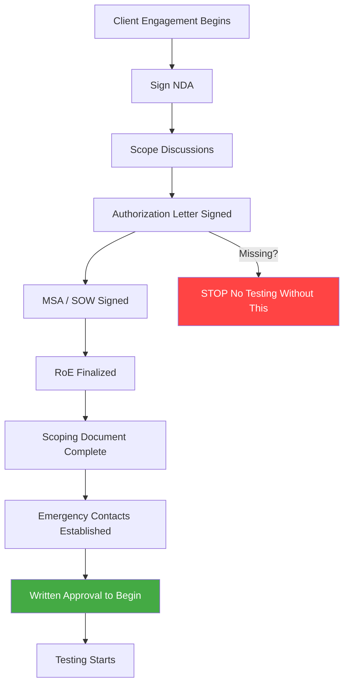
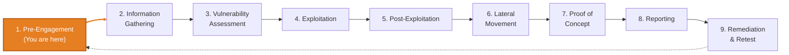

import { Callout } from 'nextra/components'

# Pre-Engagement

<Callout type="important">
 **Do not test without written authorization.** Verbal approval gives zero legal
 protection. Require this for every engagement, every time, even for repeat clients.
 The only difference between a pentester and a criminal is a signed piece of paper.
</Callout>

### Phase 1: Legal Foundation

<Callout type="default" emoji="?">
 **Ask yourself**

 - Does the person who signs the authorization have legal authority to authorize testing?
 - Or is that person only an IT admin without standing?
 - Is the authorizing entity the legal *owner* of the systems, or only the operator?
 - For subsidiaries, does the parent company need to authorize too?
 - For managed or cloud infrastructure, does the MSP or hosting provider need separate authorization in addition to the client's?
 - Does the paperwork explicitly reference the IT Act 2000 Section 43 exemption for India engagements?
 - Is your professional liability insurance active?
 - Does that insurance cover pentest activities?
</Callout>

- [ ] **Sign NDA first.** Sign the NDA before any scope discussions or sharing of technical details. The NDA covers vulnerabilities, topology, credentials, PII, and trade secrets. Use a duration of 2-5 years minimum. Keep trade secrets indefinite.
- [ ] **Obtain signed authorization letter.** Name you or your company. List exact scope, permitted methods, and testing window. Require a signature from someone with actual authority, not only the IT admin. Reference IT Act 2000 Section 43 for India engagements.
- [ ] **Sign MSA or SOW.** Sign an MSA for an ongoing relationship, or an SOW for each engagement. Include liability cap, indemnification, scope limitation, payment terms, and a data handling and destruction clause.
- [ ] **Create and sign RoE.** The RoE is your legal protection letter. List all in-scope and out-of-scope systems. Document permitted and prohibited techniques. Include testing windows with timezone, emergency contacts, and escalation.
- [ ] **Confirm third-party or cloud authorization.** Confirm AWS, Azure, or GCP provider pentest policy and notification forms. Contact Indian hosting providers directly. Notify CDN or WAF providers such as Cloudflare or Akamai if applicable.
- [ ] **Review professional liability insurance.** Confirm coverage for pentest activities before the window opens.

### Phase 2: Scope Definition

<Callout type="default" emoji="?">
 **Ask yourself**

 - Is the scope complete, or did the client omit assets such as subdomains, APIs, mobile backends, or staging environments?
 - Are third-party integrations such as payment gateways, SSO, or CDNs in scope?
 - Do those integrations need separate authorization?
 - Is pivoting into internal systems after initial compromise permitted?
 - Or is the engagement limited to the perimeter?
 - Which regulated data under HIPAA, PCI DSS, DPDP Act, or RBI sits inside the scope?
 - Does that change what you may touch?
 - What is the pre-agreed workflow when you discover a new asset mid-engagement?
</Callout>
<Callout type="info">
You can use tools such as [frogy2.0](https://github.com/iamthefrogy/frogy2.0) for quick external passive recon from public sources to understand the scope.
</Callout>

- [ ] **Complete scoping questionnaire** with the client. Cover network, web, AD, cloud, social engineering, and compliance.
- [ ] **Create scoping document.** Document what, how, when, and the limits.
- [ ] **Document all in-scope systems.** Include IPs, CIDR ranges, domains, subdomains, apps, and APIs.
- [ ] **Document all off-limits systems.** Include critical infra, medical devices, ICS/SCADA, prod databases, and backup or DR systems.
- [ ] **Define testing type.** Choose black box, grey box, or white box.
- [ ] **Define testing windows.** Include dates, hours, timezone, and maintenance windows.
- [ ] **Clarify permitted techniques.** Cover social engineering, physical access, DoS, account creation or data change, and data exfiltration to prove impact.
- [ ] **Identify sensitive or regulated systems in scope.** Cover HIPAA, PCI DSS, GDPR, DPDP Act, and RBI-regulated systems.
- [ ] **Define deliverables and retesting terms.** Cover report format, detail level, and executive summary. State whether the fee includes a retest or bills it separately.
- [ ] **Define scope-change workflow.** State who authorizes additions at the same authority level as the original. Require a written addendum. Cover timeline and budget impact. Update the RoE if the risk profile changes.

### Phase 3: Communication and Emergency Preparation

<Callout type="default" emoji="?">
 **Ask yourself**

 - Who exactly do you call if you cause a service disruption?
 - How fast can that person respond?
 - Who must be notified for critical or emergency findings such as RCE, active breach, or exposed PII?
 - On what channel must you notify them?
 - What is the stop trigger, meaning the condition under which you stop testing immediately?
 - If you find evidence of a *prior* breach, does the client have a CERT-In 6-hour reporting obligation?
 - Does your NDA conflict with that obligation?
 - What reporting cadence does the client expect: daily, weekly, or end-only?
</Callout>

- [ ] **Obtain contact list.** Include technical POC, project manager, legal, and emergency or on-call contacts.
- [ ] **Define escalation procedures.** State who to call on disruption. State who to notify for critical or emergency findings. State when to stop testing immediately.
- [ ] **Create communication channels.** Use email for routine matters. Use phone or Signal for urgent matters. Use a ticketing system as needed.
- [ ] **Create incident response plan.** Define what happens if testing triggers a real incident.
- [ ] **Agree on reporting cadence.** Choose daily updates, weekly updates, or updates only at the end.

### Phase 4: Deconfliction and Allowlisting

<Callout type="important">
 This prevents your testing from triggering IR alerts, SOC escalations, or IP bans.
 Share these details with the client's security team **before** testing starts.
 Without deconfliction, your pentest looks exactly like a real attack to the blue team.
</Callout>

<Callout type="default" emoji="?">
 **Ask yourself**

 - Will the SOC know you are testing, or is this a blind or red-team exercise where they are intentionally not notified?
 - If an MSSP runs the SOC, does the MSSP know?
 - The MSSP will block your IPs and escalate if left out of the loop.
 - For a blind test, who is the single deconfliction contact that can confirm your authorization if things go wrong?
 - For red team work, is there a safe word or emergency deconfliction procedure that immediately identifies you as the authorized tester if confronted?
</Callout>

- [ ] **Provide source IP addresses.** List all IPs your traffic originates from, including VPN egress, VPS, and home IP if applicable.
- [ ] **Provide VPN egress ranges.** Provide full CIDR if you use a testing VPN.
- [ ] **Provide callback or C2 domains.** List any domains payloads will beacon to, if C2 is in scope.
- [ ] **Provide phishing domains and mail sender addresses.** Include sending domains, lookalikes, reply-to, and from-addresses if social engineering is in scope.
- [ ] **Provide phone numbers.** List numbers used for vishing or callback social engineering.
- [ ] **Provide test user agents.** Provide custom user-agent strings so the SOC can filter your traffic.
- [ ] **Provide test user accounts.** Include usernames or emails created or provided for testing.
- [ ] **Provide report recipient list** for access control on sensitive findings.
- [ ] **Provide scanning schedule.** State when heavy scanning will occur.
- [ ] **Obtain written acknowledgment** from the SOC lead on the deconfliction sheet.

### Phase 5: Environment and Logistics

<Callout type="default" emoji="?">
 **Ask yourself**

 - Is this a clean workspace with zero residual data from previous engagements?
 - Cross-contamination is catastrophic.
 - Are you routing traffic through your own attributable infrastructure, or leaking straight from your ISP?
 - Is client data encrypted at rest and in transit?
 - Is access limited to only NDA-named team members?
 - Can you prove exactly what you did and when if something breaks during the window?
 - Does the client have recent, tested backups?
 - Does the client have staff on hand to restore in-scope systems if testing causes disruption?
</Callout>

- [ ] **Prepare clean testing VM or workspace.** Ensure no residual data from previous engagements. Create a snapshot before you start.
- [ ] **Confirm all tools have valid licenses and current updates.**
- [ ] **Confirm client has recent, tested backups** of all in-scope systems and staff available to restore during the window.
- [ ] **Prepare encrypted storage** for engagement data. Use LUKS, VeraCrypt, or BitLocker.
- [ ] **Prepare activity logging.** Log all testing with timestamps for legal protection.
- [ ] **Prepare report template.** Start the structure early and fill findings as you go.

### Phase 6: Final Confirmation

<Callout type="default" emoji="?">
 **Ask yourself**

 - Are the NDA, authorization, MSA or SOW, and RoE all signed and in your possession, not only "in progress"?
 - Are all emergency contacts confirmed reachable *today*, not only listed on paper?
 - Is the testing window confirmed in writing by the client?
 - Do you have an explicit written "you are clear to start" from an authorized person before the first packet leaves your box?
</Callout>

- [ ] NDA signed
- [ ] Authorization letter signed (proper authority)
- [ ] MSA/SOW signed
- [ ] RoE signed
- [ ] Contacts confirmed reachable
- [ ] Testing window confirmed in writing
- [ ] Deconfliction sheet acknowledged by SOC
- [ ] Written "clear to start" received
- [ ] **Confirm all documents signed.**
- [ ] **Confirm all contacts reachable.**
- [ ] **Confirm testing window** with the client.
- [ ] **Obtain explicit written approval to start.** Require wording such as "You are clear to start testing."
- [ ] **Start testing.**

## Reference

### Goals and Objectives of a Penetration Test

Before scoping, pin down *why* the client wants the test. The stated goal shapes
scope, methodology, deliverables, and how you rank findings. A compliance
checkbox engagement and a "can an attacker reach our crown jewels" engagement
look completely different in practice.

<Callout type="default" emoji="?">
 **Ask the client**

 - What is the client actually trying to achieve: a clean audit certificate, confirmed defenses, or a realistic breach simulation?
 - What regulatory or compliance requirement, if any, is driving this engagement?
 - Is the priority finding vulnerabilities, testing detection and response, or quantifying business impact?
 - What does "success" look like to the person paying for the test?
</Callout>

#### Primary Goal Categories

| Category | Focus |
|----------|-------|
| **Security Posture Evaluation** | Assess the organization's overall cybersecurity maturity |
| **Defensive Measures Testing** | Confirm whether existing security controls actually work |
| **Risk Assessment** | Evaluate the potential operational and financial impact of a breach |

#### Detailed Objectives

| Objective | What It Means |
|-----------|---------------|
| **Identify Security Weaknesses** | Uncover misconfigurations, software flaws, design weaknesses, and human vulnerabilities |
| **Confirm Security Controls** | Attempt to bypass security mechanisms to confirm they work as intended |
| **Test Detection and Response** | Determine if the organization can detect and respond to security incidents |
| **Assess Real-World Impact** | Simulate attacks to understand potential data loss, system compromise, or business disruption |
| **Prioritize Remediation** | Help the organization allocate resources to fix the most critical issues first |
| **Compliance and Due Diligence** | Satisfy regulatory requirements such as PCI DSS, HIPAA, SOC 2, or RBI VAPT |
| **Enhance Security Awareness** | Reveal risks that are not apparent through other means |
| **Confirm Patch Management** | Confirm patches and updates are properly applied and effective |
| **Test New Technologies** | Ensure new systems are securely configured before production deployment |
| **Establish Baseline** | Create a measurable starting point for tracking security improvements over time |

### Legal Authorization and Why It Matters

Every penetration test is technically a crime without proper authorization. The
difference between a pentester and an attacker is a signed piece of paper. This
section is the most important in the entire vault. A mistake here and no technical
skill will save you.

```mermaid
flowchart TD
    A["Client Engagement Begins"] --> B["Sign NDA"]
    B --> C["Scope Discussions"]
    C --> D["Authorization Letter Signed"]
    D --> E["MSA / SOW Signed"]
    E --> F["RoE Finalized"]
    F --> G["Scoping Document Complete"]
    G --> H["Emergency Contacts Established"]
    H --> I["Written Approval to Begin"]
    I --> J["Testing Starts"]

    D -- "Missing?" --> X["STOP No Testing Without This"]
    style X fill:#ff4444,color:#fff
    style I fill:#44aa44,color:#fff
```

<Callout type="warning">
 **Never test without written authorization.** Verbal approval, Slack messages,
 or "my manager said it's fine" are not legal protection. Obtain a signed document
 on company letterhead from someone with authority.
</Callout>

### MSA vs SOW

| Aspect | MSA | SOW |
|--------|-----|-----|
| **Purpose** | Overall business relationship terms | Project-specific engagement details |
| **Scope** | Broad: payment, confidentiality, liability, IP | Narrow: objectives, scope, deliverables, timeline |
| **Use Case** | Ongoing / multiple engagements | Each new project |
| **Duration** | Long-term (1-3 years typical) | Short-term, project duration |
| **Flexibility** | Consistent across engagements | Tailored per engagement |
| **Authorization** | Framework for services | Explicit permission for specific pentest |

<Callout type="default">
 **For repeat clients:** Sign an MSA once, then issue a new SOW for each
 engagement. This saves time on legal review and keeps the per-engagement
 paperwork light.
</Callout>

#### SOW Critical Clauses

| Clause | Why It Matters | What to Include |
|--------|----------------|-----------------|
| **Scope limitation** | Protects against scope creep | Exact systems, methods, timeline |
| **Liability cap** | Limits your financial exposure | Typically 1x-2x contract value |
| **Indemnification** | Client covers you for authorized actions | "Client shall indemnify tester for all claims arising from authorized testing" |
| **Payment terms** | Cash flow protection | 50% advance + 50% on report delivery |
| **IP ownership** | Clarity on deliverables | Reports go to the client. Tools, scripts, and methodology stay yours |
| **Limitation of findings** | Manages expectations | "Results are point-in-time and do not guarantee security" |
| **Data handling** | Legal compliance | Encryption requirements, retention period, destruction method |
| **Retesting** | Avoid free work | 1 retest included or billed separately. State it explicitly |
| **Termination** | Exit strategy | Either party can stop with N days notice, with payment for work completed |

<Callout type="default" emoji="?">
 **Is your SOW actually protecting you?**

 - Does it have a liability cap? Without one, you face unlimited claims.
 - Does the indemnification clause cover you if authorized testing causes unexpected downtime?
 - Is "scope" defined precisely enough that the client cannot claim you should have tested more?
 - What happens if the client does not pay? Is there a dispute resolution clause?
</Callout>

### Rules of Engagement (RoE) Deep Dive

The RoE is the operational contract between you and the client. It defines what
you can do, when, and how.

| Element | Description | Example |
|---------|-------------|---------|
| **In-scope systems** | Exact IPs, domains, apps | `10.10.10.0/24`, `*.target.com`, `app.target.com` |
| **Off-limits systems** | Never touch these | Production DB, medical devices, payment processing |
| **Permitted techniques** | What methods the RoE permits | Network scanning, web app testing, credential stuffing |
| **Prohibited actions** | Hard no | DoS, physical access, real data exfiltration |
| **Testing windows** | When you can test | Mon-Fri 22:00-06:00 IST, weekends 24/7 |
| **Contacts** | Names, roles, phones, emails | Technical POC, PM, emergency, legal |
| **Communication** | How to report | Email for updates, phone for emergencies |
| **Evidence handling** | How to store or send findings | AES-256 encrypted, secure channel only |
| **Critical finding protocol** | Immediate notification rules | RCE or active breach requires a phone call within 1 hour |
| **Disclaimers** | Liability protection | Point-in-time assessment, not a guarantee |

<Callout type="default" emoji="?">
 **What if the RoE is too restrictive?**

 - Does the testing window give you enough time? A 4-hour nightly window for a full network pentest is unrealistic.
 - Are the prohibited actions reasonable? If you cannot test for SQLi on a web app engagement, what is the point?
 - Can you pivot to internal systems after initial compromise, or does the RoE limit you to the DMZ?
 - Push back on unrealistic constraints. Document the impact on test quality in the SOW.
</Callout>

### NDA and What It Protects

Sign the NDA **first** before any scope discussions, architecture
details, or credential sharing.

| Protected Information | Examples |
|----------------------|----------|
| Security weaknesses | Vulnerabilities, misconfigurations, exploit paths |
| Company data | Trade secrets, internal processes, business logic |
| PII | Employee data, customer records, HR files |
| Technical details | Network topology, credentials, API keys, configs |
| Test results | Reports, findings, remediation status |

**Key NDA clauses:**

- **Scope of confidentiality.** State what the NDA covers. Be broad.
- **Duration.** Use 2-5 years minimum. Keep trade secrets indefinite.
- **Permitted disclosures.** Cover your team members involved in the test.
- **Data destruction.** State timeline and method after the engagement ends.
- **Carve-outs.** Cover publicly available info, independently discovered info, and legally compelled disclosure.
- **Breach consequences.** Cover financial penalties and injunctive relief.

**After you sign the NDA, you may safely discuss:** systems in scope, network
architecture, past security incidents and findings, critical business processes,
test credentials, VPN access, and documentation.

<Callout type="default" emoji="?">
 **Does the NDA create conflicts?**

 - If you discover an active breach, does the NDA prevent you from reporting to authorities?
 - If the client is violating regulations such as storing unencrypted PII, does confidentiality override your ethical obligations?
 - Clarify these edge cases upfront. Add carve-outs for legally compelled disclosures and regulatory reporting obligations.
</Callout>

### Agreement Structure and Signed Documents, Grouped

The documents above serve three distinct purposes. Grouping them this way makes
it easy to confirm nothing is missing before testing starts.

| Group | Documents | Purpose |
|-------|-----------|---------|
| **Legal** | NDA, Permission-to-Test / authorization letter, Contact information | Confidentiality, explicit signed authorization, and all stakeholder and emergency contacts |
| **Scope and Rules** | Scoping questionnaire + scoping document, RoE | Defines *what* you test and *how* you test, including boundaries and methods |
| **Contract** | Timeline, Responsibilities, Deliverables | Phases and deadlines with buffer, client-vs-tester duties, and report format, detail, and submission terms |

### Third-Party and Cloud Authorization

<Callout type="important">
 **Cloud-hosted infrastructure requires separate consideration.** Testing assets
 on AWS, Azure, or GCP without understanding their policies can cause the provider
 to ban your IP or take legal action even if you have client authorization.
</Callout>

<Callout type="warning">
 **Client authorization is not cloud provider authorization.** The client can
 authorize you to test their application, but the cloud provider owns the
 underlying infrastructure. Always confirm the provider's pentest policy
 separately.
</Callout>

#### AWS Pentest Policy

AWS permits testing **without prior approval** on these services only: EC2, WAF,
NAT Gateways, Elastic Load Balancers, RDS, Aurora, CloudFront, API Gateway,
AppSync, Lambda, Lambda Edge, Lightsail, Elastic Beanstalk, ECS, Fargate,
OpenSearch, FSx, Transit Gateway, and Amazon Bedrock AgentCore.

**Prohibited activities (hard no, regardless of authorization):**

- DNS zone walking, hijacking, or pharming via Route 53.
- DoS / DDoS attacks. A separate DDoS simulation policy exists. It requires approved partners.
- Port flooding, protocol flooding, request flooding (login/API).

Report security issues found during testing to `aws-security@amazon.com`.

#### Azure Pentest Policy

As of June 2017, Microsoft **no longer requires pre-approval** to pentest
Azure-hosted resources.

- **Permitted without approval:** your own Azure-hosted VMs, App Service apps, Functions, API endpoints, and websites. Also OWASP Top 10 testing, DAST, fuzz testing, and port scanning on your own endpoints.
- **Prohibited:** any form of DoS / DDoS attack. Use Microsoft-approved simulation partners: BreakingPoint Cloud, Red Button, or RedWolf. Do not scan or test resources you do not own or are not authorized to test.

<Callout type="info">
 Azure requires compliance with the **Microsoft Cloud Unified Penetration
 Testing Rules of Engagement.** Read these before testing. You need no approval form,
 but the RoE is binding.
</Callout>

#### GCP Pentest Policy

GCP does not require prior approval. Follow Google Cloud's Acceptable Use Policy.
Prohibited: DoS, disrupting other tenants, and testing infrastructure you do not
own.

#### Indian Hosting Providers

Always contact the provider directly. Policies vary widely and are often
undocumented. Obtain written approval before testing. Some providers will block your
IP on automated scan detection.

### Indian Legal Framework

<Callout type="warning">
 **Operating in India.** Unauthorized access to computer systems is a criminal
 offense under the Information Technology Act, 2000. Written authorization is not
 optional. It is the difference between a pentest engagement and a criminal
 charge.
</Callout>

#### IT Act 2000 Key Sections for Pentesters

| Section | Offense | Nature | Penalty |
|---------|---------|--------|---------|
| **Section 43** | Unauthorized access, downloading data, introducing virus, causing damage | Civil | Compensation up to Rs 5 crore |
| **Section 43A** | Corporate failure to protect sensitive personal data | Civil | Compensation to affected persons |
| **Section 65** | Tampering with computer source documents | Criminal | Up to 3 years + Rs 2 lakh fine |
| **Section 66** | Computer-related offenses (hacking with criminal intent) | Criminal | Up to 3 years + Rs 5 lakh fine |
| **Section 66B** | Receiving stolen computer resource or data | Criminal | Up to 3 years + Rs 1 lakh fine |
| **Section 66C** | Identity theft (using another person's credentials) | Criminal | Up to 3 years + Rs 1 lakh fine |
| **Section 66F** | Cyber terrorism | Criminal | Up to life imprisonment |
| **Section 69** | Government power to intercept, monitor, decrypt | Regulatory | N/A |
| **Section 72** | Breach of confidentiality and privacy | Criminal | Up to 2 years + Rs 1 lakh fine |

<Callout type="important">
 **Section 43 vs Section 66:** Section 43 is civil (compensation). Section 66 is
 criminal (imprisonment). Unauthorized pentesting without written authorization
 can attract **both simultaneously**. Your authorization letter is your Section
 43 exemption. Reference it explicitly.
</Callout>

<Callout type="default" emoji="?">
 **Does your authorization actually protect you under Indian law?**

 - Does the authorization letter explicitly reference IT Act 2000 Section 43?
 - Is the authorizing entity the legal owner of the systems, or just the operator?
 - If you are testing a subsidiary's systems, does the parent company need to authorize separately?
 - If your testing triggers Section 66C by using found credentials to pivot, does your RoE explicitly permit credential reuse?
</Callout>

#### CERT-In Compliance

- **Mandatory incident reporting.** Under CERT-In Directions (April 2022), organizations must report cybersecurity incidents within **6 hours** of detection.
- Reportable incidents: unauthorized access, data breaches, ransomware, website defacement, malicious mobile apps, and attacks on servers or infrastructure.
- If your pentest discovers evidence of a **prior breach**, the client may have a legal obligation to report.
- If your pentest **triggers** the client's incident response team, clarify in advance that authorized testing activity is not a reportable incident.
- CERT-In can request information from any service provider about any cybersecurity incident. Report at [cert-in.org.in](https://www.cert-in.org.in).

<Callout type="default">
 **Add a clause in your RoE** stating that authorized testing activities are
 excluded from CERT-In incident reporting triggers. This prevents the client's
 SOC from filing a report about your own testing.
</Callout>

#### DPDP Act 2023 and DPDP Rules 2025

<Callout type="important">
 **Two instruments, phased rollout.** The **DPDP Act 2023** (assented 11 August
2023) is the parent legislation. The **DPDP Rules 2025** (notified 13 November
2025 by MeitY and published in the Gazette on 14 November 2025) provide operational requirements. Those requirements include consent mechanisms, breach
 reporting procedures, record-keeping standards, and Data Protection Board
 composition. Provisions start in phases:

 - **13 November 2025.** Data Protection Board of India established. Procedural provisions are in effect.
 - **13 November 2026.** Consent Manager registration and related obligations take effect.
 - **13 May 2027.** Core compliance duties take effect. These include notice, consent, security safeguards, breach intimation, Significant Data Fiduciary obligations, and Data Principal rights.

 Confirm which provisions are currently enforceable before you rely on or advise
 about specific obligations. The legal landscape is actively evolving.
 *(last confirmed: 2026-07)*
</Callout>

| Aspect | DPDP Act 2023 | DPDP Rules 2025 (added detail) | Impact on Pentesting |
|--------|---------------|--------------------------------|---------------------|
| **Data Fiduciary obligations** | Client must protect personal data | Clear privacy notices specifying purpose, categories, retention | Client is liable for PII you access during testing |
| **Consent** | Processing requires lawful basis | Operational consent mechanisms, informed and unambiguous consent | Your authorization letter and SOW equal lawful basis for testing |
| **Data breach notification** | Notify Data Protection Board and affected individuals | Reporting timelines, nature of breach, mitigation steps | If you find an existing breach, client must report per Rules timeline |
| **Cross-border transfer** | Personal data only to notified countries | Transfer mechanisms and permissible jurisdictions | If testing from outside India, ensure compliance |
| **Data minimization** | Collect only what is necessary | Record-keeping standards for processing activities | Do not exfiltrate real PII to prove a point. Use screenshots |
| **Children's data** | Special protections required | Enhanced safeguards and consent for minors' data | If testing systems with minors' data, use extra care |
| **Penalties** | Up to Rs 250 crore for significant non-compliance | - | Both client and tester can be liable |

<Callout type="default">
 Your NDA and SOW should explicitly reference both the IT Act 2000 and the DPDP
 Act 2023 / Rules 2025. Include clauses for lawful basis through authorization,
 data minimization during testing without dumping entire databases, data
 handling and destruction after the engagement, breach notification procedures, and
 record-keeping of what personal data you accessed.
</Callout>

#### Indian Industry-Specific Compliance

| Regulator | Sector | Pentest Requirement |
|-----------|--------|---------------------|
| **RBI** | Banking, NBFCs, payment systems | Mandatory VAPT at least annually and after major infra changes |
| **SEBI** | Securities, stock exchanges, listed entities | Cybersecurity framework requires regular security assessments |
| **IRDAI** | Insurance | Information security audits including penetration testing |
| **TRAI** | Telecom | Data protection and security audit requirements |
| **MeitY** | Government IT | Guidelines for securing government websites and applications |
| **NPCI** | UPI/payment infrastructure | Regular security assessments for all participants |

<Callout type="info">
 **RBI mandates** VAPT at least once a year, and after any major infrastructure
 change. Many Indian enterprises follow this annual cycle. Plan engagements
 accordingly. RBI-regulated engagements may require reports in specific formats.
</Callout>

<Callout type="default" emoji="?">
 **Is this a compliance-driven engagement?**

 - If yes, which regulator's requirements are driving it? The report format and testing scope may need to match their framework.
 - Does the client need the report for an audit? Ensure your methodology aligns with the auditor's expectations.
 - Are there specific controls the regulator mandates testing? For example, RBI requires testing of internet banking, mobile banking, and SWIFT systems.
</Callout>

#### Test Account Lifecycle

| Phase | Action |
|-------|--------|
| **Provisioning** | Client creates test accounts with agreed privilege levels. Document username, initial password, MFA status, and permissions |
| **MFA handling** | Agree on the method such as TOTP, SMS, or hardware key, and who controls it. If testing MFA bypass, clarify scope |
| **Password reset authority** | Can you reset test accounts? Can you reset discovered or compromised accounts? Usually: test accounts yes, real accounts no |
| **Monitoring** | Client may want to monitor test account activity separately from real users |
| **Revocation** | Disable or remove all test accounts within 24 hours of engagement end. Obtain written confirmation |
| **Credential vaulting** | Store all credentials in an encrypted vault such as KeePassXC or Bitwarden. Never use plaintext. Never put them in the report. Never put them in Slack or email |

#### Proof-of-Impact Boundaries

| Rule | Details |
|------|---------|
| **Maximum records** | Agree on the max records to extract as proof, for example 5-10 rows. Never dump entire tables or databases |
| **Screenshot rules** | Redact PII before including in reports. Blur names, emails, phone numbers, and account numbers. Show structure, not content |
| **Hashing evidence** | Hash sensitive data used as proof with SHA-256. Include the hash in the report, not the plaintext |
| **No real PII exfiltration** | Prove access with row counts, column names, table structure, and 2-3 redacted sample rows |
| **Credential evidence** | If you crack hashes, report the hash and that you cracked it. Do not report the plaintext. Example: "cracked in X time using Y method" |
| **Data in transit** | Proof-of-concept data must be encrypted in transit. Never send raw evidence over unencrypted channels |
| **Retention** | All evidence follows the same retention and destruction schedule as the rest of the engagement data per NDA |

<Callout type="default" emoji="?">
 **How much proof is enough?**

 - You found a SQL injection into a 10M-row customer database. You do NOT need to dump it. A screenshot of `SELECT COUNT(*) FROM customers` returning `10,247,831` plus a 3-row sample with redacted PII is sufficient.
 - You cracked the domain admin hash. The report says "Domain admin NTLM hash cracked in 4 minutes using hashcat with rockyou.txt." That is proof. The plaintext is not in the report.
 - You found credentials in a config file. Screenshot with the password partially redacted (`admin:P@ss****`). Full credentials go in the encrypted vault, not the report body.
</Callout>

### Pentest Process

<Callout type="info">
 This is a brief orientation of the full pentest lifecycle. Detailed methodology
 for each phase lives in dedicated notes throughout the vault.
</Callout>

```mermaid
flowchart LR
    A["1. Pre-Engagement<br/>(You are here)"]:::current --> B["2. Information<br/>Gathering"]
    B --> C["3. Vulnerability<br/>Assessment"]
    C --> D["4. Exploitation"]
    D --> E["5. Post-Exploitation"]
    E --> F["6. Lateral<br/>Movement"]
    F --> G["7. Proof of<br/>Concept"]
    G --> H["8. Reporting"]
    H --> I["9. Remediation<br/>& Retest"]

    classDef current fill:#e67e22,color:#fff,stroke-width:2px,stroke:#b35409;
    class A current;
    linkStyle 0 stroke:#e67e22,stroke-width:3px;

    %% Optional: Show process as loop/cycle visually
    I -.-> A
```
### Reporting What the Deliverable Looks Like

| Report Section | Audience | Content |
|---------------|----------|---------|
| **Executive Summary** | C-suite, management | Business risk in plain language, overall risk rating, top 3-5 findings |
| **Technical Findings** | IT / security team | Each vuln: description, severity, evidence, reproduction steps |
| **Remediation Steps** | Engineers / developers | Specific fix for each finding, prioritized by risk |
| **Methodology** | Auditors / compliance | Testing approach, tools used, scope covered |
| **Appendices** | Reference | Full tool output, scan results, raw evidence |

<Callout type="default">
 **Write the report as you go.** Every time you compromise a host, stop and
 document the finding. Waiting until the end means forgotten details, weaker
 evidence, and a worse report. The report is half the engagement value.
</Callout>

<Callout type="default" emoji="?">
 **Does the report meet the client's actual needs?**

 - Is this for a compliance audit? Match the report format to the regulator's expectations.
 - Does the client need CVSS scores? Some compliance frameworks require them.
 - Who will read this? A CISO needs different language than a developer.
</Callout>

### Communication and Emergency Procedures

| Situation | Action | Channel |
|-----------|--------|---------|
| Routine status update | Email summary | Email |
| Found critical vulnerability such as RCE, SQLi with data access, or auth bypass | Notify within 1 hour | Phone and encrypted email |
| Caused service disruption | Stop testing immediately, notify | Phone call with no delay |
| Found evidence of active breach or prior compromise | Notify immediately, document | Phone call to emergency contact |
| Unclear if system is in scope | Stop, ask, obtain written confirmation | Email for paper trail |
| Testing complete | Deliver report via secure channel | Encrypted email or secure portal |

<Callout type="default" emoji="?">
 **When in doubt, what do you do?**

 If you discover unexpected systems, ambiguous scope, or anything that makes you
 uncomfortable, **stop and ask.** A 10-minute pause to confirm scope costs
 nothing. Testing an out-of-scope system costs everything.
</Callout>

### Testing Environment and OPSEC

| Requirement | Why | How |
|-------------|-----|-----|
| **Dedicated testing VM** | No cross-contamination between engagements | Fresh VM per engagement, snapshot before starting |
| **Encrypted storage** | Client data protection, legal compliance | LUKS (Linux), VeraCrypt, BitLocker |
| **Activity logging** | Legal protection to prove what you did and when | Script sessions, Burp logs, terminal history with timestamps |
| **VPN / dedicated infrastructure** | Attribute traffic to your testing, not your ISP | Route through your own VPS or VPN, document source IPs |
| **Tool licensing** | Legal and professional compliance | Burp Suite Pro, Nessus, Cobalt Strike all properly licensed |
| **Data destruction** | NDA compliance | Secure wipe all client data after retention period, document destruction |

<Callout type="warning">
 **Cross-contamination is catastrophic.** Including exploit code, credentials, or
 network architecture from Client A in Client B's report can identify the
 original client, destroy trust, and create legal liability. Use a fresh workspace
 every time.
</Callout>

<Callout type="default" emoji="?">
 **Can you account for every action you took during the engagement?**

 - If the client's system goes down at 3 AM during your window, your timestamped logs prove exactly what you were doing.
 - If a dispute arises about what you tested, your activity logs are your defense.
 - Log everything: commands run, tools used, timestamps, and source IPs.
</Callout>

### Backup and Recovery

Before testing starts, confirm:

- [ ] Client has **recent, tested backups** of all in-scope systems.
- [ ] Document recovery procedures and keep them accessible.
- [ ] Client has staff available to restore systems if needed during the testing window.
- [ ] You discussed the risk of accidental service disruption.

<Callout type="default">
 Pentesting should not cause damage, but it can. A misconfigured exploit, an
 aggressive scan against a fragile legacy system, or a privilege escalation that
 crashes a service can cause disruption. Having recovery options is not paranoia.
 It is professionalism.
</Callout>

### Confidentiality and Data Handling

| Aspect | Requirement |
|--------|-------------|
| **Storage** | Encrypted at rest with AES-256 minimum, access-controlled |
| **Transmission** | Encrypted channels only such as GPG email, SFTP, or encrypted portal |
| **Retention** | Per NDA, typically 30-90 days after report delivery |
| **Destruction** | Secure wipe. Do not only remove the file. Document the destruction |
| **Access** | Only team members named in the NDA |
| **Regulated data** | Follow industry-specific requirements such as HIPAA, PCI DSS, DPDP Act, or RBI VAPT |

<Callout type="info">
 **India / DPDP Act:** Any personal data encountered during testing must be
 handled per the Act's provisions. If testing uncovers a data breach, the client
 may need to report to the Data Protection Board of India. Your NDA should
 include DPDP Act compliance clauses.
</Callout>

### Professional Liability and Insurance

| Type | Covers | Why You Need It |
|------|--------|-----------------|
| **Professional Liability / E&O** | Claims from testing such as accidental damage or missed vulnerability | Client sues because your test caused an outage |
| **Cyber Liability** | Data breach liability, incident response costs | You accidentally expose client data |
| **General Liability** | Bodily injury, property damage during on-site testing | Physical testing goes wrong |

<Callout type="info">
 **India:** Companies like ICICI Lombard, Bajaj Allianz, and HDFC Ergo offer
 professional indemnity policies. Starting coverage of Rs 25-50 lakh is
 reasonable. Some MNC clients require proof of insurance before signing
 contracts.
</Callout>

### Methodologies and Frameworks

| Framework | Focus | Best For |
|-----------|-------|----------|
| **PTES** | 7-phase pentest standard | General penetration testing, most common |
| **OWASP Testing Guide** | Web application security | Web app assessments |
| **NIST SP 800-115** | Formal security assessment | Government / NIST-aligned orgs |
| **MITRE ATT&CK** | Adversary tactics and techniques | Red teaming, realistic threat simulation |
| **OSSTMM** | Security testing methodology | Comprehensive security audits |

<Callout type="default">
 Most professional pentesters do not strictly follow one framework. They combine
 elements from multiple. Use PTES for structure, OWASP for web testing methodology,
 and MITRE ATT&CK for realistic attack simulation. Document which framework or frameworks you
 are using in the SOW.
</Callout>

<Callout type="default" emoji="?">
 **Which methodology fits this engagement?**

 - Compliance-driven under RBI or SEBI? Use PTES or NIST. Auditors recognize these.
 - Web application focused? OWASP Testing Guide is the standard.
 - Red team or adversary simulation? MITRE ATT&CK maps directly to real threat actor behavior.
 - Does the client require a specific framework? Some RFPs mandate PTES or OWASP explicitly.
</Callout>

#### PTES Seven Phases

1. Pre-engagement Interactions
2. Intelligence Gathering
3. Threat Modeling
4. Vulnerability Analysis
5. Exploitation
6. Post-Exploitation
7. Reporting

#### OWASP Testing Guide Core Testing Phases

1. Information Gathering
2. Configuration and Deployment Management Testing
3. Identity Management Testing
4. Authentication Testing

<Callout type="info">
 OWASP is continuously updated by the community to address emerging threats and
 contains distinct testing procedures with practical examples for nearly every
 web vulnerability. Use it as the backbone for web-app engagements.
</Callout>

#### Choosing the Approach

| Engagement Type | Recommended Framework(s) |
|----------------|--------------------------|
| Black-box network test | PTES + MITRE ATT&CK |
| Web application test | OWASP Testing Guide |
| Government / compliance | NIST SP 800-115 |
| Red team assessment | MITRE ATT&CK |
| General pentest | PTES (most common) |

### Freelance Penetration Testing, Business and Legal Guide

<Callout type="info">
 This section covers the business, legal, and operational aspects of freelance
 pentesting with India-specific context.
</Callout>

#### Business Preparation (India)

| Structure | Best For | Registration | Liability |
|-----------|----------|-------------|-----------|
| **Sole Proprietorship** | Starting out, low overhead | PAN + GST registration | Unlimited personal liability |
| **LLP** | Small team, liability protection | MCA registration, LLP agreement | Limited to contribution |
| **Pvt Ltd Company** | Scaling, investors, large contracts | MCA incorporation | Limited to shareholding |

<Callout type="default">
 **Starting out?** Sole proprietorship is simplest. You need only a PAN card and GST
 registration. Move to LLP when you want liability protection or add
 partners. Move to Pvt Ltd when you are scaling or need to bid on large government
 contracts.
</Callout>

<Callout type="default" emoji="?">
 **Does your business structure protect you?**

 - As a sole proprietor, your personal assets are at risk if a client sues. Is the engagement value worth that risk?
 - An LLP provides liability protection. Consider it once you are doing engagements over Rs 5L.
 - For government tenders on the GeM portal, some require a registered company or LLP.
</Callout>

#### Freelancer Engagement Documents

Every engagement, minimum:

1. **Proposal / Quote.** Cover scope overview, pricing, timeline, and methodology.
2. **NDA.** Sign before sharing any details.
3. **SOW / Contract.** Cover detailed scope, deliverables, payment terms, liability cap, and indemnification.
4. **RoE.** Define authorized testing boundaries.
5. **Authorization letter.** Require explicit written permission from an authorized person.
6. **Invoice.** Use a GST-compliant invoice with SAC code 998314.

### Quick Reference Document Timeline

```mermaid
gantt
    title Pre-Engagement Document Flow
    dateFormat X
    axisFormat %s

    section Legal
    NDA Signed                   :done, 0, 1
    Authorization Letter Signed  :done, 1, 2
    MSA/SOW Signed               :done, 2, 3

    section Scoping
    Scoping Questionnaire        :active, 2, 3
    RoE Finalized                :3, 4
    Scoping Document Complete     :4, 5

    section Prep
    Emergency Contacts Set       :4, 5
    Environment Ready            :5, 6
    Written Approval to Begin    :crit, 6, 7
```

| Before NDA | After NDA | Before Testing |
|------------|-----------|----------------|
| General discussions only | Detailed scope talks | Signed RoE + Authorization |
| No sensitive details shared | Credentials, architecture, past findings | Scoping document finalized |
| High-level pricing | Detailed SOW with clauses | Contact list + incident response plan |
| | | Written approval to start |

#PreEngagement #Legal #Scoping #RulesOfEngagement #Authorization #Freelance #India #Compliance #NDA #ClientCommunication

