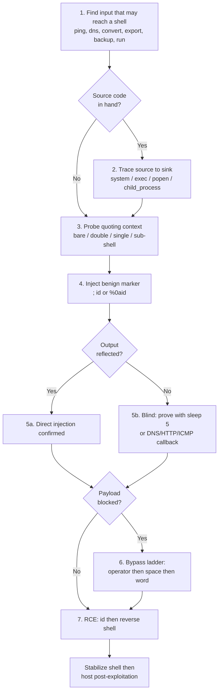

```mermaid
flowchart TD
    A[1. Find input that may reach a shell<br/>ping, dns, convert, export, backup, run] --> B{Source code<br/>in hand?}
    B -- Yes --> C[2. Trace source to sink<br/>system / exec / popen / child_process]
    B -- No --> D[3. Probe quoting context<br/>bare / double / single / sub-shell]
    C --> D
    D --> E[4. Inject benign marker<br/>; id  or  %0aid]
    E --> F{Output<br/>reflected?}
    F -- Yes --> G[5a. Direct injection confirmed]
    F -- No --> H[5b. Blind: prove with sleep 5<br/>or DNS/HTTP/ICMP callback]
    G --> I{Payload<br/>blocked?}
    H --> I
    I -- No --> K[7. RCE: id then reverse shell]
    I -- Yes --> J[6. Bypass ladder:<br/>operator then space then word]
    J --> K
    K --> L[Stabilize shell then<br/>host post-exploitation]
```